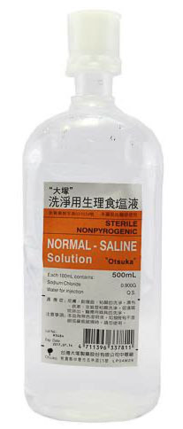
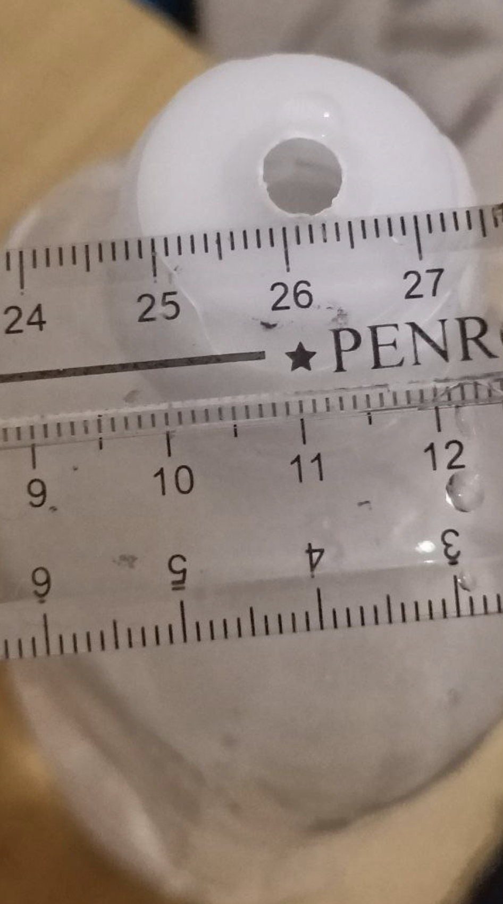
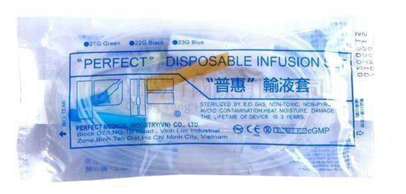

點滴注水入膀胱
===
by Kuba

## 一、前言
醫院中常見的點滴經過簡單的調整，也能變為實踐BDSM用的道具(多虧某生物的創意(?)   
這次介紹的玩法屬於控制類，將排泄的權力交由對方管控，喜愛被控制想必會非常興奮；若是對控制無感，則可以專注體驗於膀胱的膨脹與緊繃感，詳細的心得就交由某生物續寫(笑。

## 風險

- 膀胱與尿道本身是無菌狀態，容易受傷與感染，不管是插入還是灌入都是需要專業技術的，請參考[尿道章節](readme.md#尿道)與下方的說明，或者尋找有護理師專業的朋友協助。
- 膀胱有其容納極限，且有體質差異。過量/過於強力的灌入可能造成破裂，這是立即的生命危險。（普遍來說一般人的膀胱可以有300-350cc的容量，請依據個人體質尋找適當的量）
- 灌滿的膀胱等地方是非常脆弱的（想像成裝滿水的水球），外力的衝擊很可能造成破裂，可能造成生命危險，請一定要避免。
- 膀胱、尿道等都是粘膜的所在，非常脆弱容易受傷，請避免過於粗暴，也要避免感染的可能性
- 留意溫度，避免燙傷與凍傷
- 請勿插入無法排出的東西
- 導尿管插入並使用水球膨脹起來之後，要小心不要拉扯，以免膀胱出血，也要避免對陰莖的摩擦，以免尿道粘膜受損。

## 二、器材
1. 導尿管 
2. 沖洗用或注射用生理食鹽水(沖洗用的生理食鹽水請買大口徑開口4-6mm，需要跑多家藥局問問；注射液則在大醫院附近的藥局或醫療用品店較有可能進貨)。 
  - 
  - 
3. 輸液套 (醫療用品店與部分藥局有供應) 

## 三、步驟
1. 先放置導尿管 <font color=gray size=2>([參見導尿術](imgs/urethra_tunneling.pdf))</font> 
2. 拆開輸液套。輸液套分為頭端<font color=gray size=2>(白色塑膠尖管)</font>，與尾端<font color=gray size=2>(為塑膠接頭，被藍色蓋子蓋住，後方套著黃色橡皮管)</font>。將尾端的塑膠接頭拆除，只留下黃色橡皮管，然後把管子放進導尿管的尿液出口端<font color=gray size=2>(要放置穩固，避免尿液流出)</font>
3. 頭端插入生理食鹽水瓶，瓶身舉至高過於膀胱的高度，食鹽水會因重力作用而進入膀胱。也能在食鹽水的瓶底開個小洞，透過大氣壓力的作用，灌入的感覺會變得更明顯。若對方感到不適或快壞掉時(?)，可將食鹽水瓶放於地面，液體就會流入瓶中，緊繃感就會舒緩。

## 四、心得與討論 <font color=green size=2>from mizuno</font>
```
雖然嘗試過幾次能量果凍注入，但是被灌到極限還是第一次〃・ω・〃
插入導尿管後把點滴拉高，一開始的時候事實上沒什麼感覺，我想應該是管徑限制了流速
但一分鐘過後就很明顯的感受到壓力與膨脹感，那個壓力讓人忍不住想尿，但是出口已經被導尿管的氣球鎖定了。
即便努力的牽動膀胱的肌肉，但需要與重力與阻力對抗，排出的速度相當緩慢，
努力了幾十秒之後，確實膀胱中的壓力有減輕了，但是只要一但放鬆，數秒鐘就會感受到壓力再次被注入，很快再次抵達了極限，只能無用的掙扎著 ⁄(⁄ ⁄•⁄ω⁄•⁄ ⁄)⁄ 

另一個意外的發現是，擠壓的膀胱會將前列腺往下推，如果這個時候被捅屁屁的話，那個前後夾擊實在是太過刺激(つд⊂) 
主人壞（？）
```

