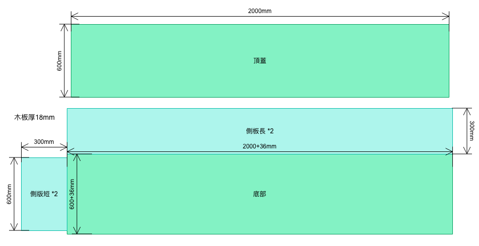
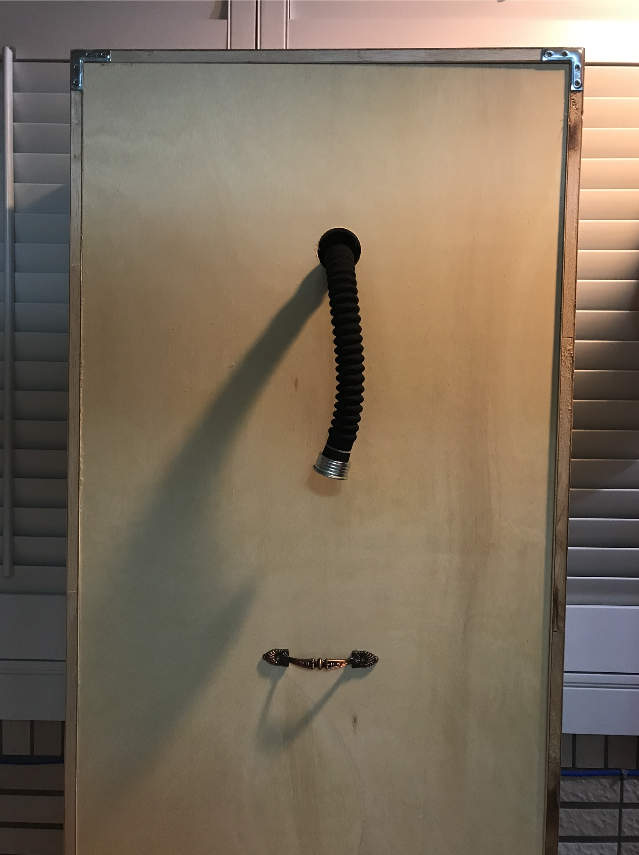
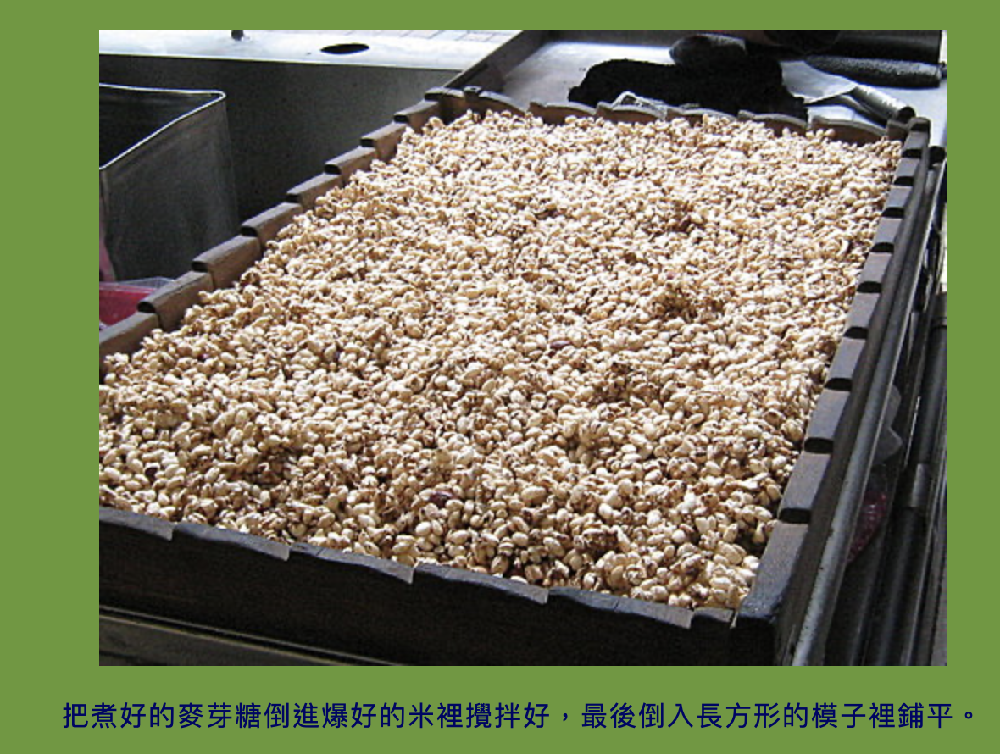
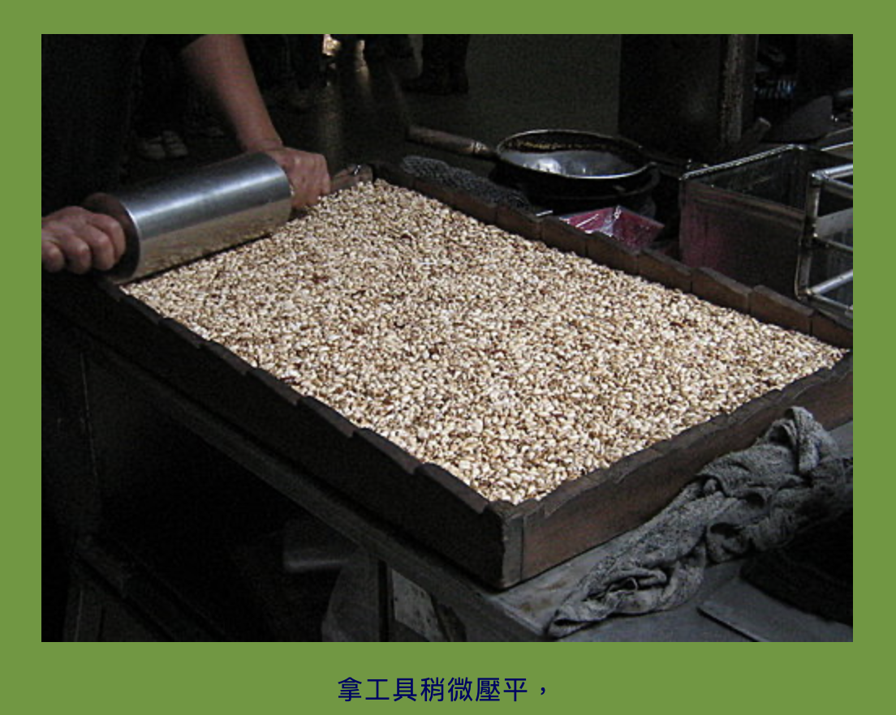
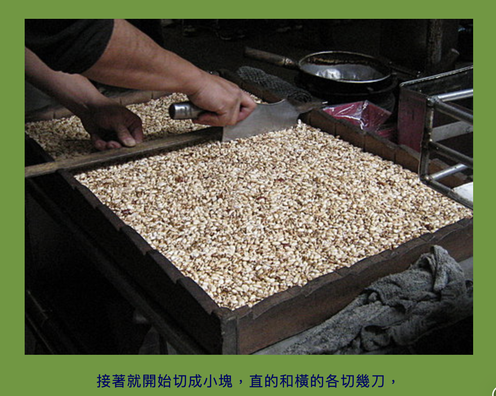
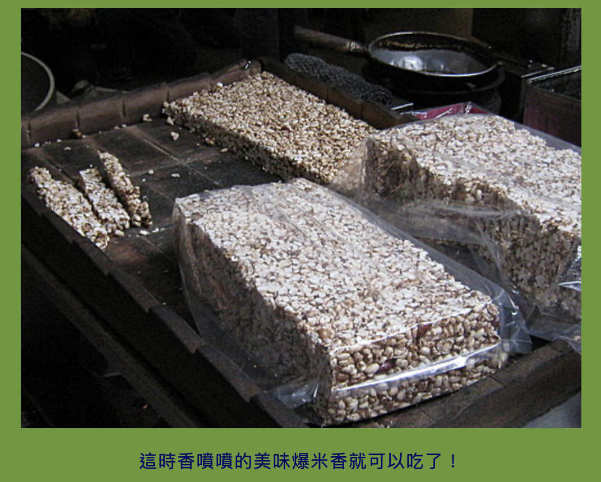
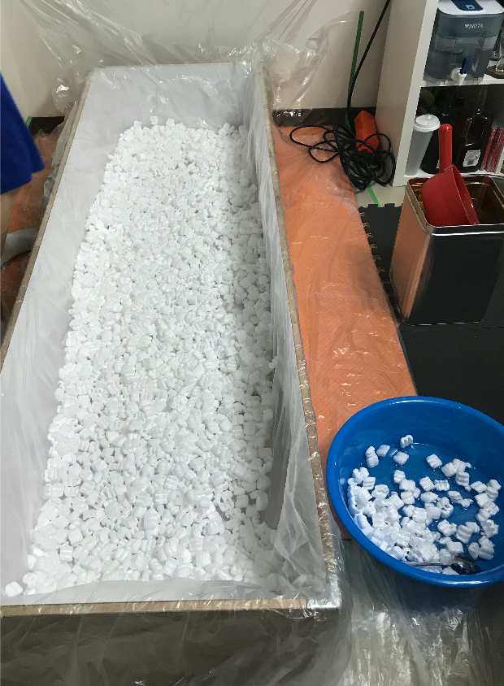
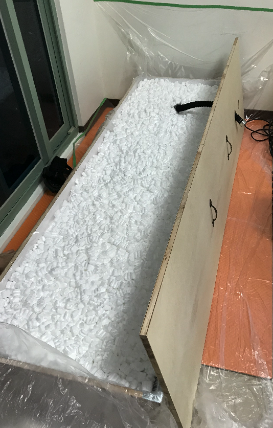
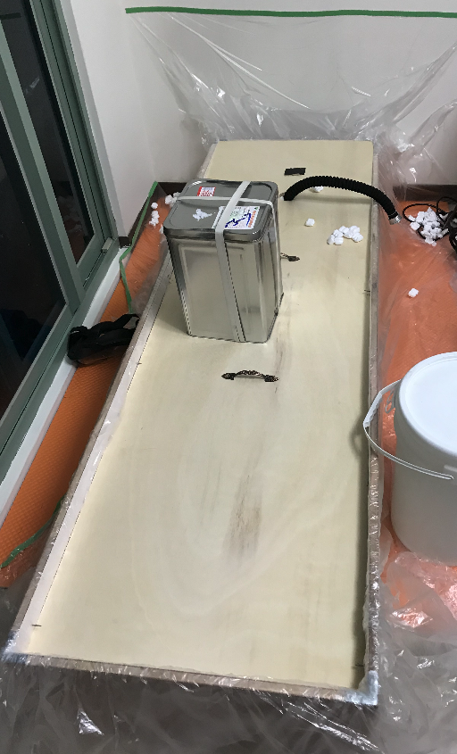

箱入 / 埋葬 / 醃漬
=====
被拘束後安裝了玩具，裝入沒有辦法掙脫的箱子內送上貨車，一邊忍受著玩具的震動，一邊胡思亂想著會被送到哪邊，怎麼對待，會不會就這樣埋起來沒有人來救了？也是一種動態的完全拘束體驗呢。

這個版本的木箱蓋子比較特殊，比起箱體略小所以蓋上時可以繼續往下滑動壓縮空間。也因此玩法略有不同的是，人進去之後，需要使用填充物將剩餘空間填滿，最後在上蓋加壓，以達成完全拘束無法活動的效果。

由於這種玩法基本上外界很難對裡面給予刺激，所以一些遙控的玩具是必要的，也或者可以在蓋子預留電動玩具通過的孔。

## 資源

- [R18短漫：ろるゐ紳士 箱入り娘](https://www.pixiv.net/artworks/46805657)
- [R18短漫：Sumomo堂 人柱志願](https://exhentai.org/g/1642165/5b2d8960e5/)
- [R18短漫：Sumomo堂 生贄巫女](https://exhentai.org/g/1685488/8708c4e4c9/)
- [R18短漫：ろるゐ紳士 埋起來](https://www.pixiv.net/artworks/80057697)
- [R18 twitter短漫](https://twitter.com/NimbleTail/status/1274508622077194243?s=20)
- [twitter短漫](https://twitter.com/wa_bu_ki/status/1209868569179086848?s=20)
- [twitter 箱子拘束](https://twitter.com/yohan555/status/1261944514513702912?s=20)
- [twitter 箱子拘束](https://twitter.com/K1nkMega/status/1264047082194653184?s=20)

## 材料

[木板裁切訂製](https://www.ruten.com.tw/item/show?21623834062265)

這家很方便，只要把設計圖畫好，算好多少尺寸的板子幾塊，直接詢問他就會告訴你金額，並切好送到府，只需要裝訂即可。建議選擇18mm厚的木心板，箱體才夠結實

## 填充物

單純木箱事實上裡面還有不少活動空間，所以會需要填充物來填滿壓實，實現完全拘束的效果。一般電子器材緩衝使用的「乖乖粒/popcorn」是不錯的選項，體積大、重量輕、價格便宜。不要用太細碎的保麗龍，如果不小心吸入會引起大麻煩的。使用沙子、泥土也是很有趣的，不過搬運跟處理上面會比較累一些。

要留意關在裡面事實上很熱，會大量流汗，所以填充物基本上不太容易回收利用（除非你住鄉下可以曬）

豆渣也是一個選項，還身兼美白功效（？），如果附近有豆漿店的話，可以前一天預約免費索取大量的豆渣來玩，說是要做堆肥的就好。

- [乖乖粒](https://www.ruten.com.tw/item/show?21939036710056)
- [沙、土、卵石](https://www.ruten.com.tw/user/index00.php?s=goingto168)
- [水麥芽23kg鐵桶原裝](https://shopee.tw/M86%E6%B0%B4%E9%BA%A5%E8%8A%BD5kg%E5%8F%A6%E5%94%AE%E6%B7%A8%E9%87%8D23kg%E9%90%B5%E6%A1%B6-i.3534891.18780885)

## 工具

- 電鑽，IKEA的[FIXA](https://www.ikea.com.tw/zh/products/integrated-lighting-and-electronics/accessories-for-installation/fixa-art-80196102)雖然足夠簡單的鑽孔，但是對於使用開孔器不夠力。所以後來還是拿了一般的插電電鑽。
- 我有使用[1mm的細鑽頭](https://www.ruten.com.tw/item/show?22016442567605)作為鎖螺絲的定位
- 打呼吸管用的洞，可以使用一般電鑽搭配[開孔器](https://www.ikea.com.tw/zh/products/integrated-lighting-and-electronics/accessories-for-installation/fixa-art-00302333)
- [木工螺絲](https://www.ruten.com.tw/item/show?21443547475220)：請選擇長度至少為36mm以上的螺絲，避免連接力不足。我大概用了四十隻吧，五金行都有
- 選用：[L型固定用金屬片 內側](https://www.ruten.com.tw/item/show?21651809606307)，同時可以做為控制壓縮蓋子最低的阻擋器
- 選用：[L型固定用金屬片 頂部](https://www.ruten.com.tw/item/show?21729722578237)，四片夠了
- 選用：[防水矽膠](https://www.ruten.com.tw/item/show?21711526365492)，如果會裝入液體的話稍微補一下，不過我建議使用前還是拿塑膠防塵布或帆布先墊在裡面，也比較好清理。
- [上蓋用的提把](https://www.ruten.com.tw/item/show?22030931927402)，挑順眼好握的，五金行都有

## 設計圖



也想設計成 西洋吸血鬼棺材 或是 埃及法老木乃伊 的型態，不過裝訂上面就會比較複雜一點了，也許事後用彩繪的也是不錯的。

蓋子上須預留呼吸管穿出的洞，也可以打一些用來通過玩具的線路的洞

這份設計圖找上面的木板裁切大概要花4280$



## 裝訂

要留意對方切好的木板會有誤差，建議先用膠帶做初步組立之後再裝訂

本來我想用釘子，但是釘了幾隻之後發現效果似乎沒有木工螺絲好，噪音也大

木工螺絲事實上可以使用電鑽鎖緊，不過我的電鑽功率比較小又怕滑牙，所以是用手鎖的。

一般我會先用細鑽頭鑽孔做定位，這樣螺絲鎖入時比較不會歪掉，也比較好鎖。但留意不要使用太粗的鑽頭，會降低螺絲咬合的能力。

使用的螺絲數量相依於你希望箱子有多牢固

## 風險與注意事項

由於是壓縮上蓋，所以一定要加入填充物，不然可能會壓傷裡面的人。如果不想使用填充物，那裡面最好安裝一些支撐材料，或者使用卡榫固定上蓋。

如果壓縮太緊的話，可能會發生「沒有空間可以勃起」的狀況，無法靠玩具弄到射，有好有壞需要注意。

受試者必須穿戴呼吸管，推薦使用蘇聯防毒面具GP-5m（可對話）。如果不能對話，箱子裡面要設置緊急通報按鈕。使用蘇聯防毒面具時，頭部上蓋差不多剛好會頂到面具，所以壓縮時，最好還是稍微把頭部固定一下，免的壓傷頭部

實驗發現不使用呼吸管也是可行的，不過頭部要特別保護，避免吸入填充物，也要避免被擠壓。這次的做法是把頭部的填充物拿掉之後，用塑膠布保護頭部隔絕其他填充物跑上來，並且釘住木板確保頭部空間。

裡面很熱，需要留意補充水分與熱衰竭的風險

如果使用乳膠衣，要留意填充物可能會吃掉乳膠衣上面的保護油，有減短壽命的風險。

如果你沒有使用乳膠衣又想要玩麥芽糖，最好先在全身塗上乳液保護肌膚，並且使用乳膠泳帽與保鮮膜之類的組合來保護你的毛髮。雖然麥芽糖可以泡熱水溶解，不過扯到毛還是會痛的

## 可能的玩法

- 單純關起來，使用遙控器玩弄
- 當成醃漬物埋起來，例如納豆或味增之類（事實上可以使用食品廢料如豆漿店的豆渣自製）
- 爆米香

### 爆米香
大家都有吃過爆米香，爆開的米的香氣，搭配焦糖/麥芽糖混合後充分包裹緊密黏合，最後切成方方正正的小零食。






曾經做過這樣的夢，在巨大的糖果屋工廠中被吊起來，浸泡在糖漿中後撈起，然後在爆米花池中滾動黏滿一層，如此一層又一層的反覆包裹，最後被真空包裝起來出貨的奇妙春夢。雖然買不起工廠，不過想要像爆米香一樣被黏著與擠壓的硬硬實實的話，那你千萬不能錯過這個！

* 當然，你也可以不使用麥芽糖，單純用填充物壓緊事實上也幾乎無法移動的，具測試似乎只差在手指頭的活動程度，沒有麥芽糖的情況還能稍微撥開填充物。

#### 使用材料
- 乖乖粒14才一大包
- 水麥芽23kg一桶

#### 流程

先以三層塑膠布墊底，由於最終麥芽糖還是會沈澱到底部，充分鋪墊可以避免事後清理的一團糟。麥芽糖建議事先用熱水（洗澡能接受的最高水溫）浸泡個幾個小時，流動性會比較好一些。



一層爆米香一層糖

[短片：爆米香 - 一層米香一層麥芽糖，黏個紮紮實實](https://youtu.be/x-3sPTxS4tQ)

完全蓋滿後，蓋上蓋子，然後上去踩一踩確保密實壓縮。



最後壓上重物，有插入栓來避免蓋子鬆脫，不過還是要確保緊急狀況時可以最快速度拆除。請設一個鬧鐘確保不會把人在裡面放置超過他可以接受的時間。



[短片：爆米花 - 掙扎的氣壓改變把爆米花從預留的孔洞中噴了出來](https://youtu.be/Zu4KZnM7OPk)

#### 結束開箱

你可能會需要拉受試者一把，他已經被黏成一大塊了。你可以先幫他剝除身上大塊的填充物，並使用塑膠布鋪墊通往浴室的通路。

沖熱水＋肥皂會比較容易移除身上黏著的麥芽糖

#### 受試者感想

```
我在玩的時候理智特低，一下子就會斷線，當踏進箱內的那刻，就開始幻想自己逐漸被裝箱的過程，全身套上膠衣，視線慢慢被保麗龍覆蓋，想掙扎時發現，被灌入了樹脂(X ，漸漸的失去活動能力，同時事前裝上的玩具逐一開始發動，逐漸在痛苦與快感中來回游離。

給我的感覺是非常緊實的，基本上有被(麥芽糖)淋到的地方都不大能動，自己唯一的失算就是面具太小了，另一點，因為蓋子不是固定的所以會往下壓，一方面緊實程度增加，不禁又硬了幾分(X，一方面隨著時間下降，防毒面具會漸漸的被卡到、歪掉。

如果還有下次 我一定要拖人下來 (✪ω✪)
```