產卵 / eggs
===
前輩太多了，我就只轉文了（？）

[愉悅的產卵Play](https://www.ptt.cc/bbs/LGBT_SEX/M.1525186730.A.6F2.html)

[Re: 愉悅的產卵Play](https://www.ptt.cc/bbs/LGBT_SEX/M.1526296556.A.132.html)

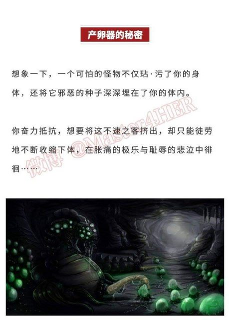
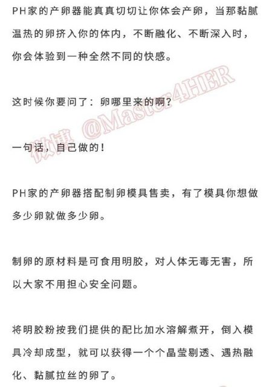
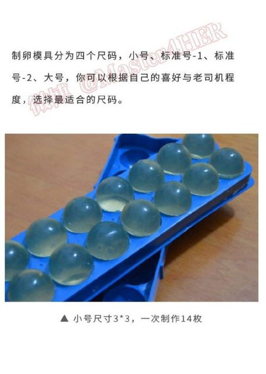
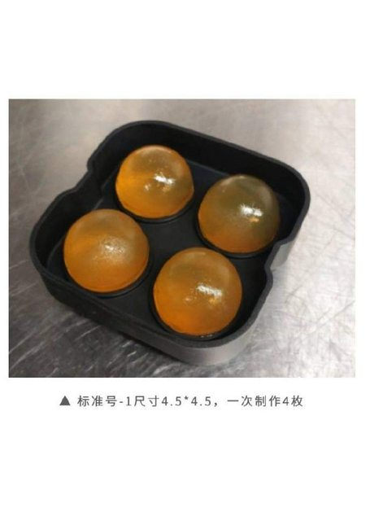
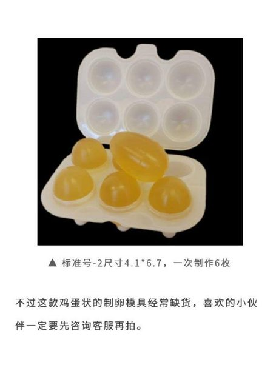
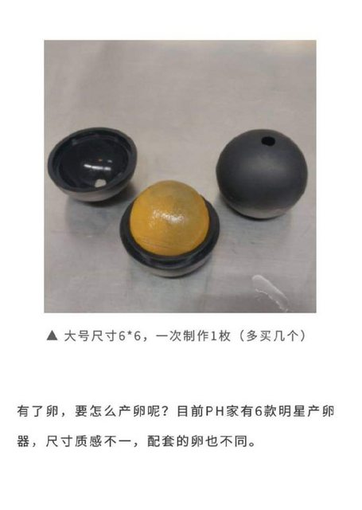
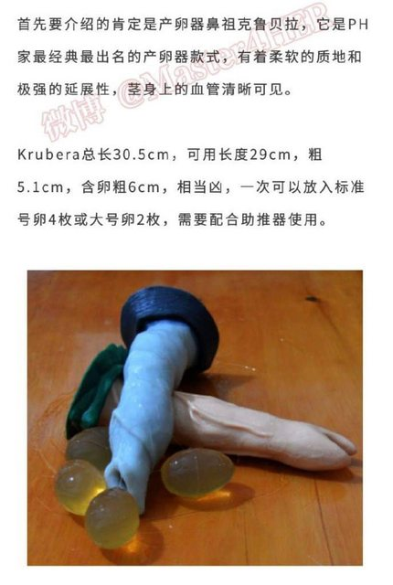
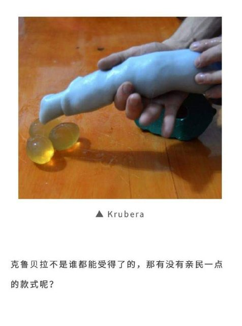
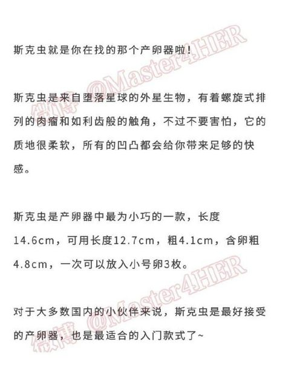
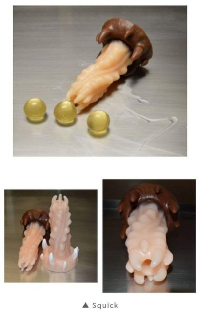
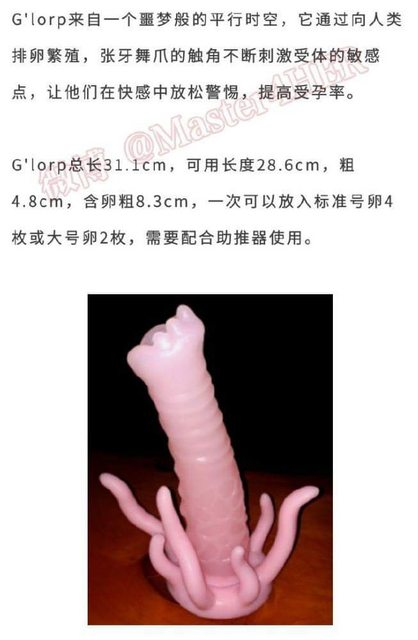
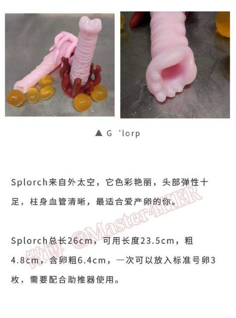
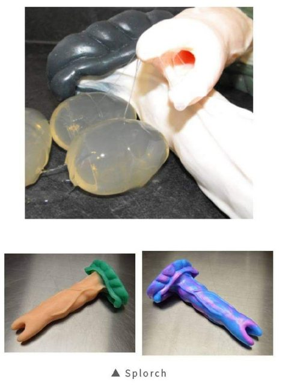
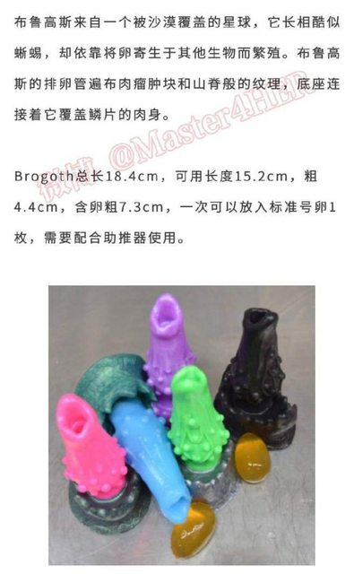
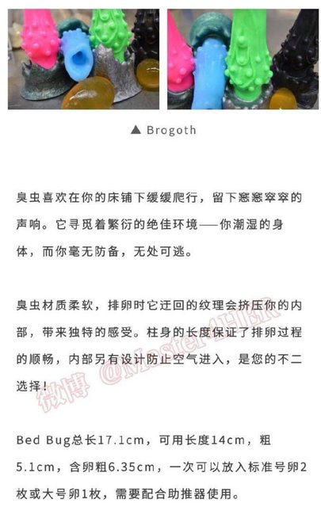
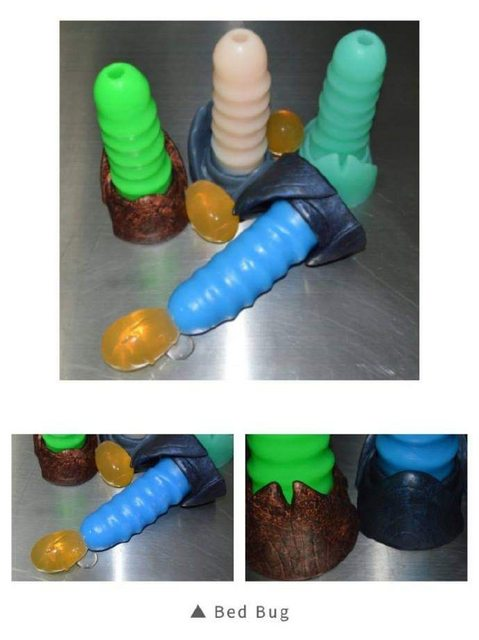

產卵管主要是來自 [PrimalHardwere](https://www.primalhardwere.com/)，[產卵管頁面](https://www.primalhardwere.com/category/ovipositors) 。

雖然產卵管看起來都很可怕（？），但是像是[Krubera](https://www.primalhardwere.com/product/OKR)這隻卻是意料之外的友善。可能是因為柔軟且空心的關係，相當適合用來做放鬆與擴張練習，可以進入的長度與粗細都遠比一般矽膠玩具多得多。

## 卵的選擇與製作

### 吉利丁

雖然PrimalHardwere主要鼓勵使用吉利丁製作卵，優點是在體溫中可以慢慢溶解，不過這種卵有一些問題在，例如回到常溫時會軟化，一捏就碎，在通過產卵管時也很容易就爛成一團了，在冰箱放一週以上還會長霉，冷凍也會變質，每次使用前都要現做變得相當不方便。 （我個人則是不喜歡吉利丁的腥味）

吉利丁本身的材質是豬皮的膠質，不知道跟膠原蛋白是不是同一件事，烘培材料行有賣，粉狀或片狀都可以。要特別留意不要買到有調味或是摻了別的東西的，也不要買到吉利T（一種洋菜粉），一定要買豬或牛製作的吉利丁。

https://www.primalhardwere.com/posts/eggs-howto 這邊有做蛋要使用的吉利丁用量計算機，以及Youtube上的製作教學

由於每個模具都使用60公克左右，我會建議可以買1kg裝，只要避免受潮放置陰涼處可以用很久

粉末狀的則比較容易操作，片狀要先一片一片分開泡水，比較麻煩些

要特別留意的是，先泡水要泡室溫水，不可以泡熱水，會很快結塊導致後面要攪拌很久，容易焦鍋

可以考慮隔水加熱，比較不容易焦鍋

不用加熱到沸騰，通通融化表面有一些泡沫時就可以倒入模具了

先把表面的泡沫刮掉，倒入模具時會比較輕鬆好控制，常常會倒進模具結果上面20%都是泡沫，這樣做出來的蛋就缺一角不好看也不好用。

如果真的卡了泡沫，可以間隔緩慢注入吉利丁，吉利丁會慢慢把氣泡趕出來（比較重的關係），用一隻筷子引導流向也是有幫助的

### 替代方案

另一種方式可以用高筋麵粉做麵團，揉成喜歡的尺寸後，丟進熱水去燙熟後冷凍。這種麵糰蛋的優點是跟貢丸一樣結實，且冷凍可以保存數個月，不過因為他不會融化，假設吞了太多顆，可能會造成彼此之間卡在一起的腸堵塞，那就只能跑醫院了，所以這種麵糰蛋只能少量使用。

另一種不使用產卵管的話，可以考慮買[蛋型的握力球](https://www.ez66.com.tw/products/soft-gel-egg%E6%89%8B%E9%83%A8%E6%8F%A1%E5%8A%9B%E7%90%83%E3%80%90sp-047-1%E3%80%91)，在各大醫療用品行都有機會找到。不過這種矽膠球跟產卵管不搭，阻力會很大推不進去
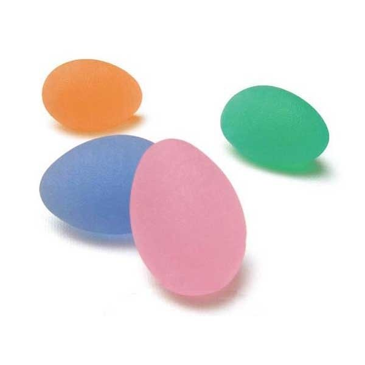

除了這些比較大顆一點的蛋，小顆點的蛋也是很有趣的，例如波霸粉圓，一堆顆粒擠在直腸裡，被手指攪拌時的四處碰撞的觸感也是相當棒的，十分推薦。