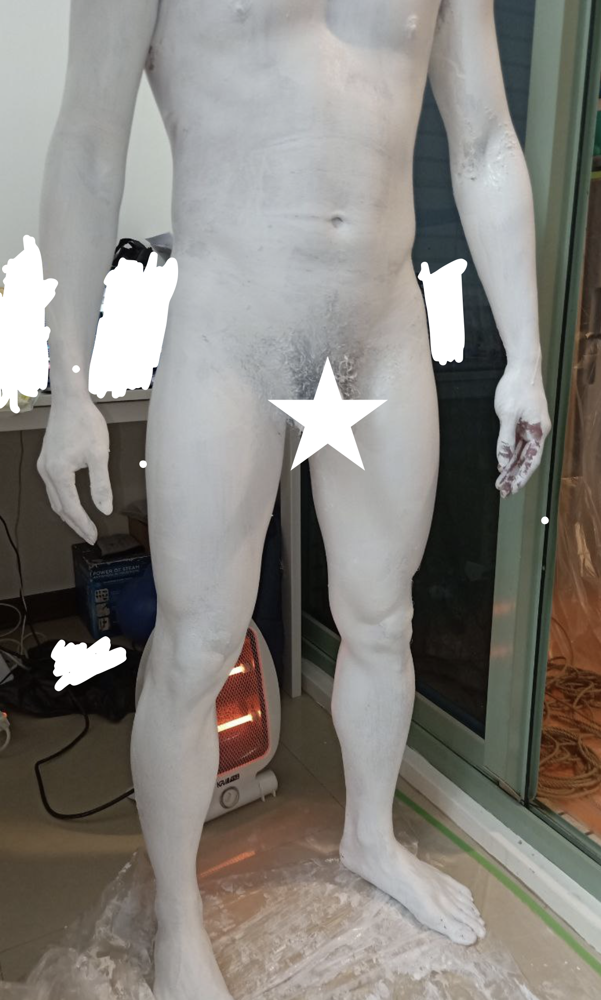

乳膠漆 emulsion paint
=====
相對[液態乳膠](latex_liquid.md)來說，乳膠漆正常來說不該用在人體身上... 但是人類的慾望克服了一切（？）

即便與液態乳膠類似，甚至包含可能的過敏原（阿摩尼雅）也是相同的，不過我覺得上色效果更好，價格也更便宜，甚至刺激性還低一點，加上清潔意外的簡單，似乎可以推廣

不同之處在，液態乳膠常常會弄的很厚帶來拘束感，但是乳膠漆似乎相對不容易做的很厚，也容易因為撕扯、沾黏等原因被破壞，效果可能接近messy play

## 資源、Tags
參照 [液態乳膠](latex_liquid.md)

## 警告與注意事項
乳膠漆畢竟不是用在人體的東西，且有過敏的疑慮，請先進行肌膚測試，並且做好心理準備

靠近粘膜、口眼鼻的部分可以使用水溶性顏料替代，不過依然需要小心避免進入粘膜

如果過程中有任何刺痛、刺激、紅腫等，請立即停止並用大量清水沖洗患部，用毛巾快速清理身體後前往急診室檢查。

實測毛黏著乳膠的部分可以輕鬆清除，但是還是要留意這個可能性，若真的發生無法清除的狀況，可能要考慮剪除。

## 準備
乳膠漆一罐，本次使用 [NIPPON PAINT 立邦漆 淨味兒童漆](https://www.trplus.com.tw/p/016077928)，店員表示沾到皮膚也不會有問題。全身塗兩層約消耗330g(1/3罐)

[三至五指寬刷子一隻](https://www.trplus.com.tw/p/000298002)

剪刀、一字起子（或鑰匙開罐用）

水性顏料（補足臉上的色彩用）、毛筆粗細的水彩筆一隻

可拋棄容器、拋棄式塑膠布

護膚乳液

可選：吹風機/電熱器，避免身體過冷與加速乾燥

## 流程

* 身體洗淨擦乾後，抹上護膚乳液減少過敏機率
* 刷上乳膠，不要一次太厚會乾很慢
* 使用吹風機加速乾燥（也幫受試者保溫），一層乾燥可能需要15分鐘左右
* 反覆進行，2層足以蓋掉膚色

徹底乾燥前，碰到東西可能會導致沾黏，要留意避免

## 清潔
意料之外的，超級好洗。基於乳膠本身會成為薄膜，沖水的時候自己就會浮起來，手一搓就掉了。

毛的部分也沒怎麼沾黏，一樣搓一搓拉一下就下來了，這一點與之前玩的液態乳膠有絕大的差異，不過不確定是不是有個體差異/產品差異

要留意搓下來的部分會堵塞水溝，記得搓一搓就要撈去垃圾桶免得積水

## 實驗

### 受試者感想
同[金粉、銀粉、雕像化](gold_silver_state.md)