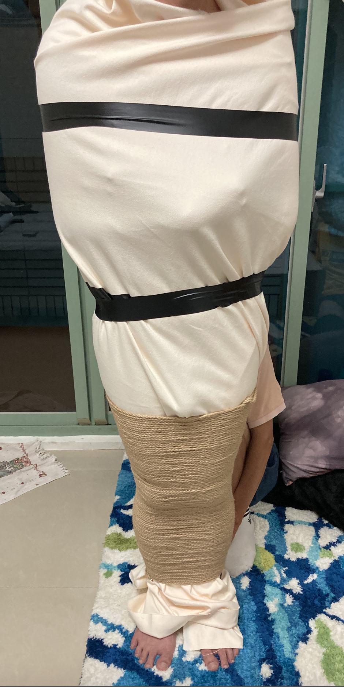
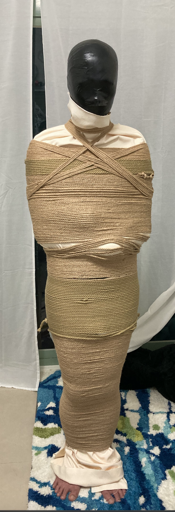
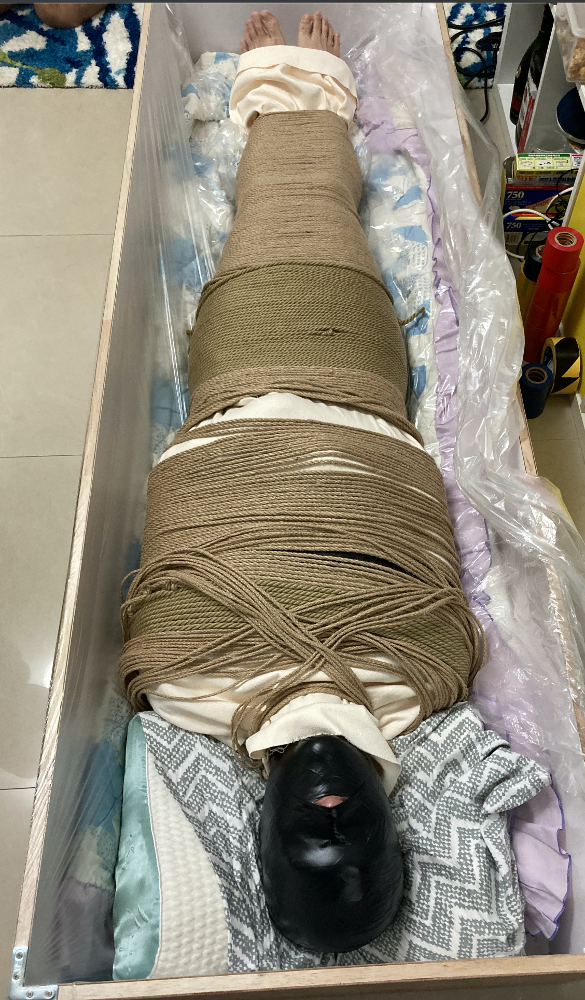

麻繩木乃伊
===
常見的膠帶木乃伊雖然有光滑、好看、膠般質感的優點，但畢竟與真實使用亞麻布的木乃伊還是完全不同的存在。

而在重度拘束中，膠帶木乃伊綁太緊難以持久，鬆一點又容易掙脫爆衣（？），若想要長時間遊玩或過夜的話，沒有彈性的麻繩可能會是更好的選擇，所以有了這場實驗

注意事項
---
未經處理的麻繩會有細刺，直接貼合皮膚會造成疼痛麻癢與過敏，請先使用麻布或保鮮膜打底

材料
---
- [大量的麻繩](https://www.ruten.com.tw/item/show?21405166171745)，至少4kg（6mm）
- 麻布，從永樂市場購買，至少兩碼，捆身體打底用，主要是取不容易蓄熱，好排汗透氣，呼吸可透過，質感與麻繩一致。
  - 可以另外準備一塊包腳的麻布，作為腳底的收尾。頭的部分則建議選更透氣的布，或是預先剪開呼吸口
- 準備柔軟可舒適躺下的地方，與適當的空調維持體溫

麻繩若細一點用量會比較省，但是捆的圈數也會隨之提升不少，會延長包的時間

過程
---
使用麻布在身上捲起，若有腳的麻布可以先包，然後用膠帶大略收束固定



從下往上開始用麻繩纏繞，我們是一人持繩球放線，一人貼合，兩人一起繞著受試者旋轉。如果容易暈的放線者可以考慮拉高點從對方頭頂上放線

持繩放線者需要留意麻繩上的應力適當的旋轉釋放，不然麻繩容易繞一段時間之後自行卷在一起，會降低纏繞的速度

接繩的位置應避開背後，避免躺下時結卡在背上降低耐受時間

纏繞時若遇到突起部分如手肘等位置需要留意，從寬到細的階段繩子很容易散掉，可以多幾個人手協助固定，最好有一個人可以用針線稍微縫一下

捆包到脖子的階段的落差很大，需要特別處理。我是採用斜向捆包的方式，可惜最後繩子不夠了捆不完，頭的部分也改採用了膠帶木乃伊（感謝兩位大大協助）



一般長時間包裹會使用導尿管來避免尿急破繭而出，不過這次的麻繩與麻布原定是一次性使用所以約定尿急就直接尿自己身上，床面則作塑膠布防水處理。

避免過多干擾導致無法入眠，所以只在後面安裝了有線跳蛋一枚，原定在白天時啟動

捆包完畢拍照後，三人合力放倒裝入棺木中，不過放倒的過程中麻繩結構還是變得散亂。估計也是因為這個散亂導致了後續的血流不順而提早結束



即便位於冷氣出風口，蓋上蓋子依舊會讓內部變得很悶，所以蓋子只維持了一小時就撤除了

改進
---
- 躺下麻繩散掉的部分，或許可以先製作人型背板，連背板一起捆之後放倒，這樣應該也可以提昇站著的支撐時間
- 身體突出部分容易散掉的問題，也許可以透過多繞幾層來解決

受試者心得
---
```
灰狐W的麻繩木乃伊體驗！不知道怎麼就往麻繩這方面進行了，不過偏好拘束的狐狸就開始準備，
材料：棉麻布、麻繩、灰狐一隻
預想是裁手、頭，腳來各包覆，實際在進行發現還是包整捲比較好繞所以就整卷打包了

進行感受跟膠帶木乃伊感覺差不多，比較沒有那種拉扯或貼服感，繩子一層一層的繞上去直至無法動彈，到這邊的體感感受都沒有任何的不適(試驗者大概繞到想暈了w)，本次有想試試看能不能放置至隔夜，所以手是以貼服胸口的方式來擺放，這邊增加了不少纏繞的困難似乎花了一段時間在這邊調整繩子貼服跟重疊的部分，有再次體驗的話建議另採其他擺放或是直接跳過這部分。

整體纏繞完成後的搬移移動就是最困難的地方，從直立變成橫躺，體感上擺放完成後繩子有部分位移進而最後發現在部分繩子重疊到上下移動都無法的狀態，整體的束縛感相較於膠帶來得比較低，但無法動彈度跟掙脫困難則比較高。

這次沒有達成預計長時間的放置，除了繩子位移造成的不適，還有棉帆布比預期的還不透風啊！但有經驗了下一次就可以進一步！，感謝本次辛苦的眾實驗者們啊！！

#註：為了之後收繩順利，強烈建議不要掙脫逃出（繩子會殘繞到整體想凸！！！
```