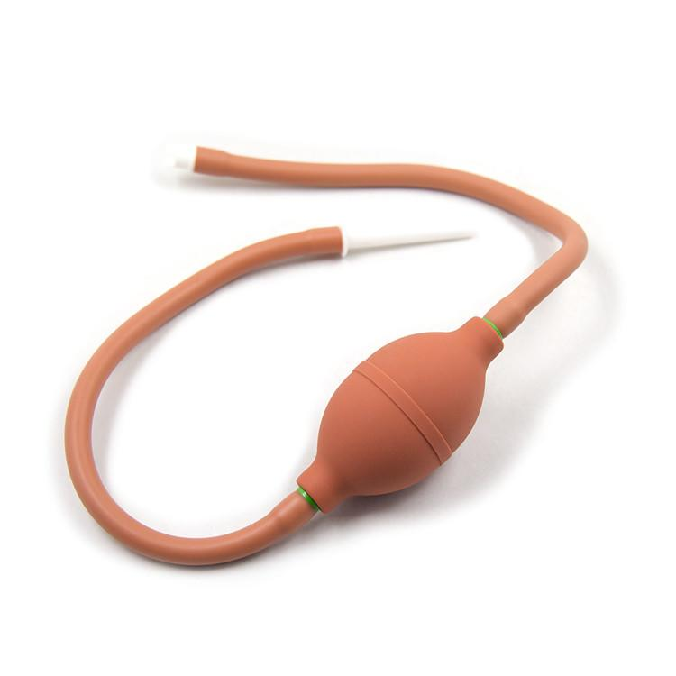

灌腸 / 膨腹 / Inflation
===
TBD

這個也是有很多面向的主題，基本元素就是把液體或氣體灌入體內，帶來「被充滿感」「腹部膨脹的外觀」「便意或尿意」「排泄被控制」等等的感受，有時也會連帶有著「腹痛」的效果，視需求調整。

要特別留意的是，這是一個違反人體先天設計的動作，是一個有一些危險性的主題，請注意閱讀風險部分。

## 資源


## 風險

- 膀胱與尿道本身是無菌狀態，容易受傷與感染，不管是插入還是灌入都是需要專業技術的，請參考[尿道章節](readme.md#尿道)，或者尋找有護理師專業的朋友協助。
- 不論是從口、肛門、還是尿道，都有其容納極限，且有體質差異。有太多因為沒有顧及自己能力/對方能力的[意外事故](https://www.setn.com/News.aspx?NewsID=433413)發生，過量/過於強力的灌入可能造成腸道、胃、膀胱等地方的破裂，這是立即的生命危險。
- 灌滿的腸道、胃、膀胱等地方是非常脆弱的（想像成裝滿水的水球），外力的衝擊很可能造成破裂，可能造成生命危險，請一定要避免。
- 水分吸收過度可能造成[水中毒](https://zh.wikipedia.org/zh-tw/%E6%B0%B4%E4%B8%AD%E6%AF%92)，請留意灌入消化道的液體總量
- 可能嗆入呼吸道造成危險，[異物進入肺部](http://epaper.ccd.gov.tw/200804/p02.html)可能會引發吸入性肺炎、急性咽喉炎、急性氣喘、阻塞性肺炎、肺氣腫、支氣管擴張或狹窄、續發性氣胸、肺膿胸、肺膿瘍等等疾病。
- 從肛門過量灌入液體，或是採取頭下腳上的姿勢，都會造成液體進入胃部，進而引發嘔吐與嗆傷的危險，請盡量避免。
- 腸道、胃、膀胱等地都是粘膜的所在，非常脆弱容易受傷，請避免過於粗暴，也要避免感染的可能性，尤其是可能摻入「體液」的時候
- 同上，請避免使用可能對人體有危害的東西來灌，任何你不會/不願意放入口中的東西都不應該被使用，包含且不限於會產生氣體的組合如汽水曼陀珠。
- 同上，酒精類飲料也絕對不行，因為腸道對酒精的吸收速度極高，即使量遠少於你平常的酒量，也依然可能觸發急性酒精中毒！
- 消化道有維持身體健康的菌叢生態，灌腸可能會導致生態系的破壞進而讓你不舒服很長一段時間，可以在結束後適度補充優酪乳之類會好一些。
- 絕對禁止的位置：耳、肚臍、鼻，這些地方灌入東西重則死亡或終生殘廢，輕則可以讓你在醫院待上好一段時間

## 灌入材料

- 空氣：簡單快速，不用準備也不用清理，一隻手壓吹氣球就可以實現，對於想把肚子撐大又不希望烙屎的人來說是很棒的方式，唯一缺點是接下來會放很久的屁，可能會屁中帶屎（？），然後有些人可能在結束之後會有脹氣的副作用。
- 水：多數人的入門，一樣一隻手壓吹球就可以實現，很多時候也不一定是想灌到膨腹，只是單純想把腸子洗一下，讓之後的遊戲不會跑出巧克力嚇到對方（？）。雖然很多人水龍頭的水就用了，不過如果要讓液體留在體內的話，還是建議使用生理食鹽水，一方面無菌，另一方面也比較不會破壞電解質平衡。
- 咖啡：前一陣子不知道為什麼很流行咖啡浣腸，號稱可以排宿便、改善體質什麼的，不過我一樣很不建議，因為咖啡因吸收速度太快，而且除了讓你烙賽之外，不會給你什麼健康改善。至於單純想玩的話就另當別論了（笑
- 黏液：個人推薦，使用太白粉（澱粉）製作的黏液，有幾個優勢：大致上無菌，因為製作過程要煮過，而且黏液本身可以視為一種緩衝溶液，不會快速吸收，也不容易刺激腸道（不容易烙賽）。其次黏液本身也可以成為潤滑，讓後續的遊戲不會容易乾掉。同時黏液本身如果做厚重一點的話，可以把裡面的東西堵住，所以不用把肚子清得很乾淨也不用擔心便便跑出來。只是黏液越厚重，也越不容易灌入，能灌入的量也越少，所以最好自己製作不同濃度的黏液試試看。唯一的問題是最好現做，然後記得使用前手插進去攪拌一下，因為濃厚狀態不太容易散熱。
- 鮮奶油：有一種壓縮[罐裝的鮮奶油](https://buy.line.me/u/article/145613)，按下去會自己打發成蓬鬆狀，雖然價格有點貴但是非常方便。只要準備一根矽膠管連接前面的噴嘴，另一方面深入體內，就可以輕鬆灌滿滿（？），而且還香香甜甜得很好吃。只不過這種鮮奶油融化速度有點快，在體內很快就會化為液體與空氣。
- 肥皂水/水+人生浣腸：肥皂水有促進腸胃蠕動的效果，但是就跟浣腸液一樣，過度刺激長期下來會導致腸壁變薄，是有副作用的。不過刺激效果強，在SM中依然是很常見的玩法。

## 灌入位置

- 後門：第一個會被想到的場景，基本上好像也沒有太多好說的（？）
- 口：嘴吧喝東西下去雖然好像隨便什麼人都應該知道怎麼做，不過當處於「被強灌」的時候，就會有別的問題了，例如如何避免嗆到之類
- 尿道/膀胱：這是一個專業領域，下面會有專門討論 TBD
- 子宮：這個我不知道該不該列入「絕對禁止的位置」，基於子宮本身也是無菌的位置，只有「子宮選擇什麼要進去」的份，任何強制灌入都可能造成危險性。不過我身邊沒有朋友在這方面有研究所以只好先放著

## 尿道/膀胱灌入

TBD

## 常用工具

充氣肛塞

## 重力壓力自動平衡系統


## 引述Komica2 夢幻輝煌的文章 有小幅度修改
```
1 夢幻輝煌 [ 2008/06/20(Fri) 16:03 ID:AJ.Scd9U ] 
有鑑於裡B某位發文者似乎在灌腸這件事上遭遇阻礙
索性發串文提出自己的見解順便給大家一個討論的空間
那麼，開始吧

1.所謂灌腸
最開始，灌腸是用於清理腸中宿便以求身體健康之效
「若要不死，腸中無屎；若要長青，腸要常清。」
因長期滯留在體內的糞便會隨時間發酵後產生毒素
是故定期進行灌腸可達到某種程度上的改善體質效果
不過，對接下來要討論的東西而言，這並不是那麼重要…

2.灌腸器具
　　現在市售的灌腸器具大部分都屬醫療用，（台灣的）情趣用品店則都是那幾種：
```

```
　　第一種手握式，每壓一次大約50cc，一公升要壓20次，兩公升40次，四公升80次，且因為吸水的動能完全來自橡皮本身的彈性，故就算是清水一次也需要近兩秒的時間，有點麻煩。
```

```
　　第二種針筒式，大概是最常見的款式？與上款相比皆為用手給予動能，但也因為相同原因和器具形狀而不適合單人使用。
```

```
　　第三種氣球式，根據爬文所找到的資料，容量並不比第一種大多少，且因為構造問題在使用時同時會有空氣進入而多少造成不適感，用調味料罐子可取代。
```

```
　　第四種點滴式，可調節流速，不需動作，容量有兩公升，說真的沒有哪裡可以挑剔。

　　不過最後，以上終究全部有同一個問題：口徑太小。
　　所以，還是推薦自己動手做吧，方法如下：
　　材料：容器（大賣場所售的牛奶、果汁之類，兩公升到五六公升都有）、管子（既然會在意口徑大小那就選擇五金行（雜貨店）賣的橘色橡膠管子吧）、強力膠（之類）。
　　作法：喝完的飲料容器洗淨、風乾，在瓶蓋或者瓶底劃一個米字型向外扳開，將橡膠管由裡向外穿過缺口，在接合處用膠固定，最後在容器上找個地方戳個洞做為通風口之用，完成。

3.灌腸液體

　　首先是使用甘油混合水製成的醫院用型，此種進入腸道之後會溶解糞便以利排出，同時也會刺激腸道產生灼熱感（甚至痛苦），且只要少量即可產生效果，灌入大量的話要不了一分鐘即可見到地獄，日本SM常用，長期使用會讓腸壁變薄且因刺激過度而變得無法正常排便，說真的不推薦。
　　其次是水，包含水在內，大部分液體皆會因為溫度不同而產生截然不同的反應，一般自來水的溫度太冷會刺激腸壁收縮，而太熱也會導致同樣的結果，所以一般而言還是用洗澡時的溫度即可，當然更熱一點的話也可以從內側感受到熱度，總之請自己拿捏，另外給喜歡玩大量的人，腸子的功用之中有一項就是吸收水分，若是灌進大量又讓其滯留太久，你的眼睛可能會浮腫一整天。
　　第三是空氣，用空氣的話幾乎沒有清潔腸道的作用，但是不用在意溫度，方法相較也容易，魚缸用的打氣機或者腳踏車的打氣筒都行，更可能灌進大量讓肚子變成氣球，不過對於喜歡大量的人而言只有膨脹而沒有重量感…也可能因為個人體質而帶來劇痛，還是自行斟酌吧。
　　最後是自製液體，想要提昇黏稠程度可以使用太白粉（片栗粉），不想被腸子吸收，想玩久一點的加洋菜（寒天），固體的話還可以丟粉圓，前陣子有被討論過，在Y拍上搜尋透明液體可以找到的商品，調淡一點的話也許不錯？總之只要是想得到的東西，盡管在注意自身安全的情況下試驗吧，上新聞終究不好玩。

4.灌腸姿勢
　　在灌腸時，除了因為內心緊張而導致肌肉緊繃無法順利灌入大量之外，還有另外一個可能的原因就是所使用的姿勢，一般站立的姿勢因為灌進去的液體是以水平面上升一般的方式前進，所以會比其他種姿勢更快感覺到壓力而排出，對於想用大量的人可能不太合適。
　　另外一種是坐姿，市面上賣的浴室用椅大多中央有開個洞，如果椅腳不是密閉型的話就可以考慮這種，坐姿比站姿更能放鬆身體，腸子所感受到的壓力也不會那麼大，但終究會比其他種姿勢更加容易受重力影響而忍不住排出。
　　接下來是側躺，一般來說側躺都是左半身著地，因為直腸上去之後的降結腸位置在身體左側，比較容易到達深處，不過之後的情況和站姿類似了。
　　平躺，「這個好像不錯嘛，因為只要到達降結腸之後接下來就幾乎沒有什麼阻力可以順利前進了」，確實，這個姿勢只要經過一小段時間就可以上水流到大腸深處，但也因為這個原因更加容易進入小腸，造成體內細菌某種程度上的失恆，使用時請小心。
　　倒立，其實這裡所說的並不是真的倒立，而是將腿往後靠近頭部，臀部則靠在牆壁上的動作，要完成這個動作有點麻煩，不過在這個情況下液體可以幾乎沒有阻力的到達橫結腸，而且不用什麼工具，只要一個底部鑽了個洞、口徑不要太大的容器即可進行（寶特瓶、大一點的話蘋果西打），不過這樣也因為瓶子相較之下位在低處，只能灌進去大約一公升多便會與腸內壓力達成平衡無法再進去，不過對於想玩大量之外的人而言說不定是個不錯的選擇？
　　最後是前趴，也就是兩膝兩手撐地的姿勢，這種姿勢在過程的前半段與平躺相同，但因為重力所以很快便可以看到自己的腹部開始隆起，同時因為水往低處流的特性而會停留在大腸的位置，想玩大量的話這是個不錯的選擇。

那麼，到這邊似乎能說的也都說完了，希望可以對那些想要嘗試，或者是追求新刺激的人產生一點幫助，不過最後最後請讓我說一句：「不要太衝，請慢慢來，慢慢增加液體的量，覺得痛就先暫時停止，可以適度的讓自己愉快，但是千萬不要讓慾望牽著走，以上」

附錄：Q&A

　　Q:各式各樣液體的作法？
　　A:太白粉請先在鍋中裝好要用的量，然後依照16:1左右的比例加入太白粉（濃淡可自行調整），充分攪拌直到確定全部溶解之後再開始加熱，加熱途中請不斷攪拌否則可能沾鍋燒焦，加熱過程中會漸漸透明，到達大約85度時糊化結束，不過為了安全起見建議還是加熱到開始冒泡為止，另外因糊化的緣故所以不容易藉由空氣散熱，請之後將整個鍋子泡入水中並不斷攪拌，同時這個液體也可作為潤滑劑使用，製作時間約為45分鐘～一小時。至於寒天則比較簡單，將片狀寒天用重量約100:1的程度加入水中，直接煮滾並保持滾沸10分多鐘，直到確定完全溶化便可，降溫方法則直接放涼或者使用上頭提過的法皆可，不過因為除非結凍否則黏稠程度與清水相去不遠，故若是使用大口徑的工具流速可能太快，可以考慮加入太白粉，修正版研究中。

　　Q:量多少比較好？
　　A:看你的用途，一般清洗的話用水大概是100cc到300cc，不過可能得多用幾次才能夠把大腸中的所有東西洗淨，若是想玩灌腸的話大概是一公升以上，超過兩公升算大量，四公升算一個臨界點，不過想要再增加的話並非不可，但是請注意自己的身體狀況，雖然腸子很耐操不過終究有極限，順便再說一件事，日本有紀錄說超過九公升之後會開始從嘴吐出，就這樣。

　　Q:用空氣的話可以做到什麼程度呢？跟水一樣嗎？
　　A:說真的，我不清楚，不過 https://www.youtube.com/watch?v=xwPSm1h46U4 這影片你拿去參考一下吧，雖然說他的體型似乎本來就算大的，不過多少證實了人類身體的彈性？

　　想到再補上，也歡迎各位提出問題或者跟大家分享您自己的經驗喔


7 名無しさん [ 2008/06/20(Fri) 22:35 ID:edu8b92k ] 
說到液體的話 我曾經用過咖啡跟酒
前者是直接拿咖啡顆粒來泡 濃度有點高(咖啡粒跟水比例大約是1:6)
晚上7 8點玩 結果一直到半夜4點多精神都是處於興奮狀態 思考整個混亂沒辦法入眠 有點難受 後來就不這樣玩了
```
