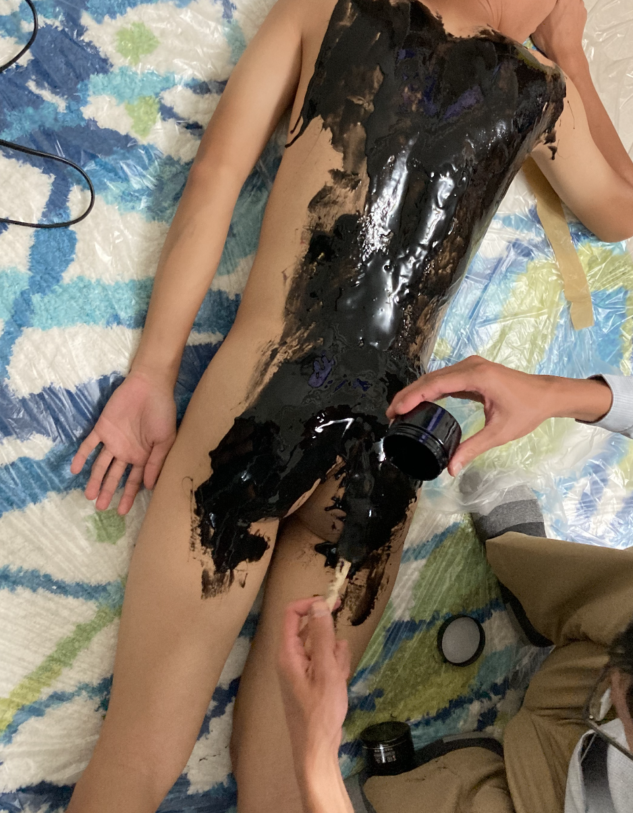
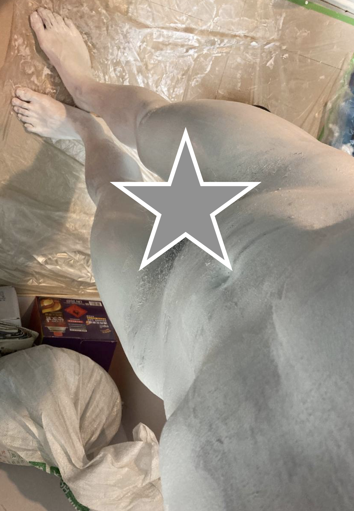

液態乳膠
=====

乳膠本身是一種特效化妝常使用的材質，與肌膚的親和性佳，且方便上色與造型，就是價格相當昂貴。

* 2021/07/04 新增乳膠漆、人體彩繪用液態乳膠

## 資源

[短漫：巫鷹 絶望1](https://www.pixiv.net/artworks/64753483) [2](https://www.pixiv.net/artworks/81016182)

[短漫：KIYO 獣化室](https://www.pixiv.net/artworks/76226243)

[雖然不是乳膠，不過人體彩繪也是很接近的主題](https://www.pixiv.net/users/6357272)

[同上](https://www.pixiv.net/artworks/83058286)

[Twitter: 液態矽膠 R18](https://twitter.com/BondageLib/status/1025459331653718016)

## tags


## 流程

* 確保身上沒有明顯的毛，若有請事先移除、剪短、或遮蓋。
* 身體洗淨擦乾後，抹上護膚乳液減少過敏機率
* 刷上乳膠，不要一次太厚會乾很慢
* 使用吹風機加速乾燥（也幫受試者保溫），一層乾燥可能需要15分鐘左右
* 反覆進行，一般會需要4層以上才能蓋掉膚色

## 注意事項

液態乳膠一般使用阿摩尼亞作為溶劑，也因此對於肌膚有過敏與刺激性，使用前請務必小範圍塗抹確認有沒有問題。

留意保護呼吸道不要被遮蓋

## 材料

[Amazon搜尋Liquid latex](https://www.amazon.com/s?k=Liquid+Latex&ref=nb_sb_noss_2)

[西門町花莉Ben Nye 液態乳膠 ll-5  946 ml $2230](https://www.pcstore.com.tw/bennye/M14277320.htm)

[德國BlackStyle](https://www.blackstyle.de/lshop,showrub,1592898630-5207,e,1592898630-5207,fluessiglatex,,,,.htm)

[中國製黑頭粉刺面膜 冰菊](https://shopee.tw/%E7%BE%8E%E8%86%9A%E5%A6%9D%F0%9F%8C%B8%E7%8F%BE%E8%B2%A8%E6%AD%A3%E5%93%81-%E5%86%B0%E8%8F%8A%E7%AB%B9%E7%82%AD%E6%92%95%E6%8B%89%E5%8E%BB%E9%BB%91%E9%A0%AD%E9%BC%BB%E8%B2%BC%E9%9D%A2%E8%86%9C-%E5%8E%BB%E7%B2%89%E5%88%BA-%E5%90%B8%E9%BB%91%E9%A0%AD-%E6%8E%A7%E6%B2%B9%E7%A5%9B%E7%97%98-%E9%BC%BB%E8%86%9C%E8%AD%B7%E8%86%9A%E5%93%81-%E7%94%B7%E5%A5%B3%E5%8F%AF%E7%94%A8-i.169314135.6105450054) 大陸廠牌，廣州製造，一罐120g，塗滿全身應該會需要20-30罐

白膠 算是不得已的選擇，乾燥速度相當緩慢，乾燥後也會變得透明，即使使用活性碳染色效果也不佳。也許唯一的優勢是可以用刷子刷跟價格便宜吧？


## 實驗：美國 人體彩繪用液態乳膠
這事實上是很久以前，大概201x年的事了，想想還是補一下

乳膠使用阿摩尼雅作為溶劑，所以對皮膚會有刺激性，由於採購乳膠在台灣幾乎找不到，只有歐美，所以花了大錢去買來試試看，要能抹四層一人份大概花了五千多

使用前詳閱說明書，他建議身上塗一層植物油避免沾黏，說不用特別去除毛髮，植物油多一點就好，但是最終的結果就是黏成一團 => 殺豬拔毛（ 受試者痛到不想面對

需要塗抹多層才足以覆蓋膚色，但是每層乾燥時間至少20-30min，導致整個過程相當緩慢且受試者容易失溫，即使使用吹風機加熱效果也不好，所以沒有塗抹完受試者受不了就提前結束了。

最後乳膠是一種天然物質（樹液），所以放久了會腐壞，買來的量在一年之後變成了一罐罐臭不可聞的泥狀物 🤮


## 實驗：冰菊

這次實驗採用 中國製黑頭粉刺面膜 冰菊 與 白膠進行，冰菊的效果相當不錯，一兩層就可以蓋掉膚色，也沒有刺激性，可惜只準備10罐遠遠不足




### 受試者感想
```
液態面膜

這個實驗失敗的原因....沒想到是因為材料不夠，哈哈，看樣子依我的身高來塗最少要二十罐，原本想說不夠可以用竹炭混白膠來代替，沒想到兩者的缺點卻一起浮了出來，能乾的沒乾，白膠也造成圖抹不均勻的狀況，尤其是沒乾掉的白膠卡身上有夠難洗掉的，哈哈，不過背部還蠻成功的！撕下來的瞬間，超爽，期待下次的實驗！也要鍛鍊一下自己腳久站的耐力，這一塗二待乾的時間少說也要四個小時。
```


## 實驗：乳膠漆


這個點子一直在腦海中，害怕過敏沒有嘗試，不過聽主人說以前有玩過，決定也投入試試看。

由於現在有許多乳膠漆有考慮到小朋友已經避免使用阿摩尼雅、減少過敏材質，可以尋找適合兒童的版本例如我們這次使用的是 立邦小王子淨味兒童漆。

整體來說敏感的效果遠低於過去買的人體彩繪專用乳膠，不過比冰菊過敏性還是高一些，大致上是可用的程度，不過嘗試前最好還是先在手背上抹一些進行過敏測試。

遮蓋顏色的效果非常棒，幾乎第一層就可以完全遮蓋膚色，考慮到他們也有提供電腦調色，我認為這可以大致上取代人體彩繪專用乳膠。

由於不可接觸眼球與粘膜，所以眼睛全程是閉的，臉部為了減少敏感使用的是廣告顏料。

白色雕像用黑色的黏液侵犯看起來的效果真的非常之色（掩面）


清潔的部分很意外的也非常簡單，肥皂洗一洗就乾淨了，不過洗下來的乳膠膜記得拿起來丟垃圾桶，會堵塞排水口
