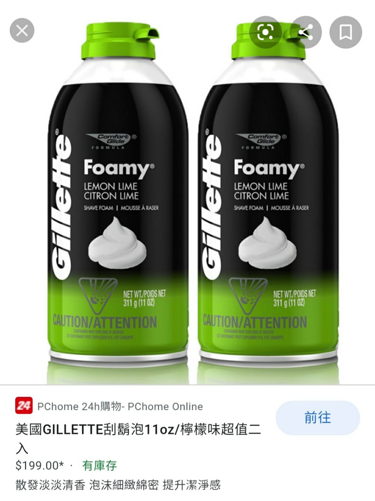
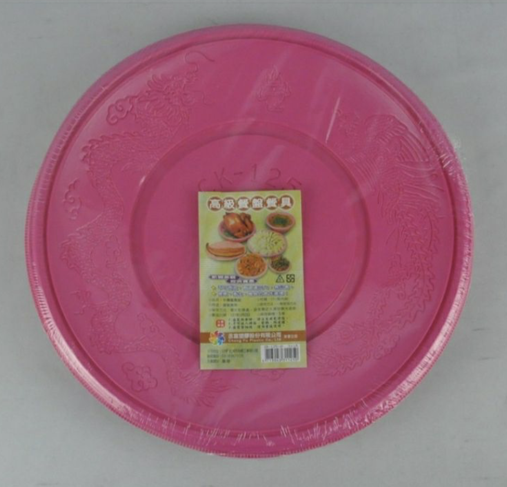

Messy - 砸派
===
最經典的Messy玩法！對於生日派對中丟鮮奶油已經有點膩了嗎？來點更繽紛的！

by Dada Cat

## 準備材料
1.刮鬍泡數罐   
可依照人數購買，2個人玩以量多的話，至少要3～5罐，比較能塗抹全身。   
刮鬍泡口味，不建議涼感、酷涼(例如薄荷)，建議可以買甜味多(例如檸檬萊姆)、或無味的，可以避免讓身體太冷太涼，也不會因為嘴巴吃到覺得不舒服。

2.五金行免洗塑膠盤   
5～10片，可覆蓋臉的大小即可。

3.小臉盆   
可預備使用，可請被砸者拿在下巴下面接刮鬍泡，並重複承裝繼續玩。

## 場地配置
建議在浴室比較好清洗，有浴缸的話更好，玩完後也可以順便洗澡增加情趣。

## 玩法：
1. 先場地配置完成
2. 使用免洗塑膠盤，擠上刮鬍泡，可先準備5～10盤或更多。
3. 請被砸者站立或坐姿在浴缸裡，砸派者可距離1～2公尺的位置，向臉部砸。
4. 重複砸派後，也可以互相玩弄對方身體，或增加互動性，感受泡沫濕滑的感受。
5. 增加趣味性
  1. 人數多的時候可以準備一些冷知識題目，玩機制問答，回答錯誤者可以砸派處罰。
  2. 加入其他材料，例如廣告顏料，從頭部倒下進行染色，顏色越多就越會有鏡面蛋糕的暈染效果。

## 事後清潔及注意事項：
基本上刮鬍泡以清水沖洗即可，如有加入其他材料，則參考其他清洗辦法。

因刮鬍泡本身也有輕微清潔力，進行砸派和塗身後，有時會使皮膚偏乾，清洗後可塗一些保濕或乳液，避免皮膚乾裂。