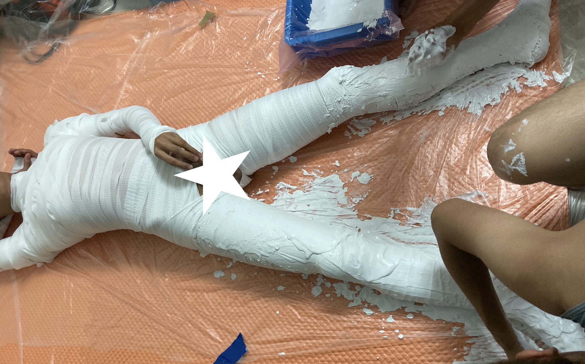

強制拘束 - 液態石膏
=====

Update20201018：實驗成功

[石膏布](plaster_roll.md)雖然有很棒的拘束效果，也沒有發熱的問題，但是從包紮到結束的時間實在是太長了。看到海外玩家透過適當調配的濃度來恰好的把石膏抹在身上硬化，感覺既漂亮又快速，所以嘗試了這個實驗。

石膏本身的風險在於，吸水硬化時的放熱作用可能會讓溫度提升到50甚至更高，可能會造成[低溫或高溫燙傷]
(https://kairos.news/65576) 。個人實驗中，單層石膏厚度不要超過1cm的話，身體還足以帶走產生的熱量，僅會感覺到熱但不至於不舒服，而實驗中發現2-2.5cm的厚度就足以感覺到燙，需要終止。

石膏的放熱反應不是在加水時的瞬間發生，而是混合後約3分鐘開始升溫，16分鐘之後開始下降。而與身體的面積也會影響到熱量的代謝能力。大面積塗抹時需要留意。

在箱子中倒入大量石膏的玩法可能會引發大量的熱量造成危險，但也許改成一次倒入1cm的厚度，等待15min散熱後再加入下一層會是可行的做法，不過拆除也是一個大問題就是。

怎麼讓石膏表面最終變得光滑漂亮，目前還不知道怎麼做


## 媒體

[專業的液態石膏玩家](https://twitter.com/Toxic_Petrified)

[專業化妝特效石膏翻模](https://www.bilibili.com/video/av48909491/)

[日本調教師的石膏紀錄](http://blog.livedoor.jp/ntmdomina-bdsm/archives/2491594.html)

[日本調教師的金粉石膏像](http://blog.livedoor.jp/ntmdomina-bdsm/archives/12518009.html)

[日本調教師七海的石膏短片](https://twitter.com/723STUDIOK/status/1162326498537349120?s=20)

[石膏漬](https://www.pixiv.net/artworks/73023921) * 注意：請勿模仿，石膏的高溫沒有處理會死人的

## 設備

臉盆、可以套著臉盆的大塑膠袋20個。

攪拌後會殘留石膏在桶子中，下一批的水會被吸走一部分導致料水比偏離變得過於乾燥。應使用塑膠袋套臉盆，每次攪拌完就更換塑膠袋來避免殘餘

若要澆注的話，也許可以使用紙黏土在身邊建立模子。

## 材料

[資生堂 TST石膏粉25KG](https://www.ruten.com.tw/item/show?21406051740729)，若要完整包裹一個人約使用半包，不過第一次實驗因為失敗太多次所以整包還不夠用。

不同廠牌的石膏的料水比與反應時間可能不同，請務必先行測試

石膏加鹽水攪拌會縮減凝結與固化的時間，如以鹽(1g)/水(15cc)的比例調製的鹽水攪拌石膏， 約可縮短一半硬化的時間。 

注意：已經開始硬化的石膏，再次加水是無法還原的！水要一次加到位

## 安全措施

有毛髮處最好剃光，或使用膠膜/矽膠泳帽保護。GG使用保險套+保鮮膜保護，或避開GG。身體可以先上一層植物油/嬰兒油，避免石膏直接接觸的過敏

上石膏的過程中需時時留意溫度與受試者溝通，發熱可能會造成燙傷

## 第一次實驗 - 失敗

1kg石膏+450cc水 攪拌1min，敷上皮膚，厚度1cm左右，初步凝固時間約15min

實際由於攪拌後會殘留石膏在桶子中，下一批的水會被吸走一部分導致料水比偏離變得過於乾燥，導致變得太濃稠，浪費了大量石膏

由於不夠厚翻身時會碎裂所以先在地面上鋪了一層石膏，但因為不夠均勻的關係導致稜角頂的受試者很不舒服，大幅縮短的可持續時間

## 第二次實驗 - 成功

900g石膏+600cc水 攪拌1min，是液體可流動的程度。上石膏的時候直接用倒的，控制流量之後再抹平，速度快上很多

身體先用普通繃帶完整捆起，四肢分開捆，作為吸附液態石膏的基底

頭部則在上石膏時刻意避開，頭上戴矽膠泳帽

地面先鋪上塑膠布，不打底直接控在地上，效果好很多。下次應該在塑膠布下面鋪墊棉被或枕頭，避免堅硬的地面縮短躺著的姿勢的耐力




### 受試者感想
```
有了上一次的實驗經驗，石膏粉與水的比例恰到好處！而這次多做了一個實驗，先在身上纏了繃帶再塗石膏，想說如果這樣土法煉鋼能不能有醫療石膏繃帶的效果，結果實驗是成功的！些許石膏有黏在繃帶上，下次的實驗可以嘗試直接繃帶泡石膏再纏身上了！石膏粉的常識遇水硬化反應會發熱，塗在身上的時候，只感覺自己像在蒸氣室或烤箱那樣的溫度，溫暖、舒適，途中我應該沒有睡著(應該，讓我唯一覺得遺憾的是，需望可以在厚一點，這次一樣是用力就爆開了，雖然因為年在繃帶上的原因，也只能掙脫到一半等人救了XD！好玩，下次石膏實驗我要繼續參加！
```

## 參考資料

<https://kknews.cc/zh-tw/news/3o6zl9g.html>

<http://163.28.10.78/content/vocation/art/ks_hc/htm/content/ch13/13-3-3-2-3.htm>

<http://www.algins.com.tw/f&q/qanda.html>

## 石膏測試記錄

```
實驗 TST超硬石膏 1:0.6水 裝入布丁瓶 半徑約2.5cm 
1:02開始攪拌
1:09 25.5度
1:28 底部24.8, 中心25.6度 已經凝固
1:51 中心34.3度，已經大致上硬化
1:53 36度
1:55 38
1:56 39.5
1:57 40.9
1:59 42.7
2:00 43.1
2:01 43.5
2:02 43.7
2:03 43.7
2:04 43.5
2:05 43.2
2:06 43
2:07 42.6
2:08 42.3
2:09 41.6
2:11 40.8
2:14 39.9
```

```
上手實測 石膏與水100:35
12:11 膏狀上手0.5-1cm厚
12:14 感受到溫度，已經初步凝固 大致上目前的溫度算溫暖，體感溫度應該在40左右
12:21 同上
12:27 同上，感覺溫度下降了
12"34 溫度降回去了，感覺略冷，表面還有點溫度
12:40 拆卸
完全乾燥了，拆開的時候感覺到與身體有一定程度的黏著性，手的邊緣有點紅紅的，感覺還是該擦一點乳液來降低敏感度

```