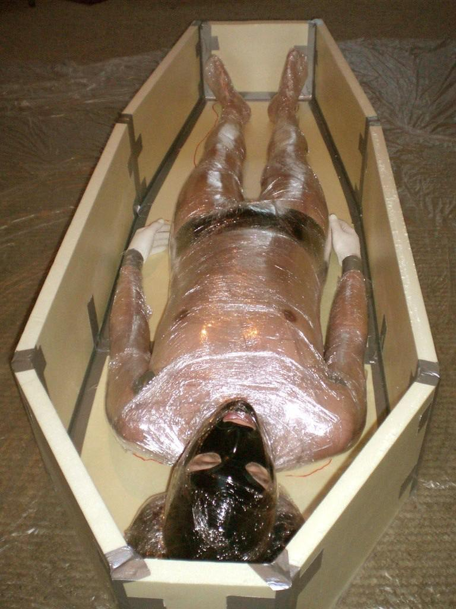
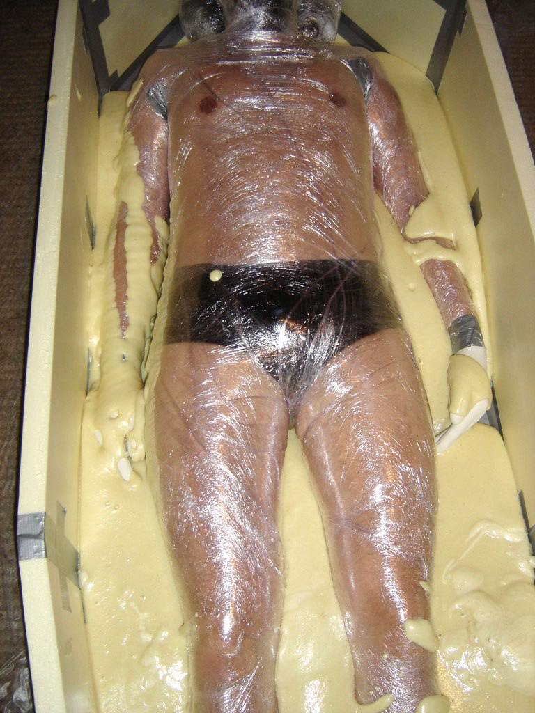
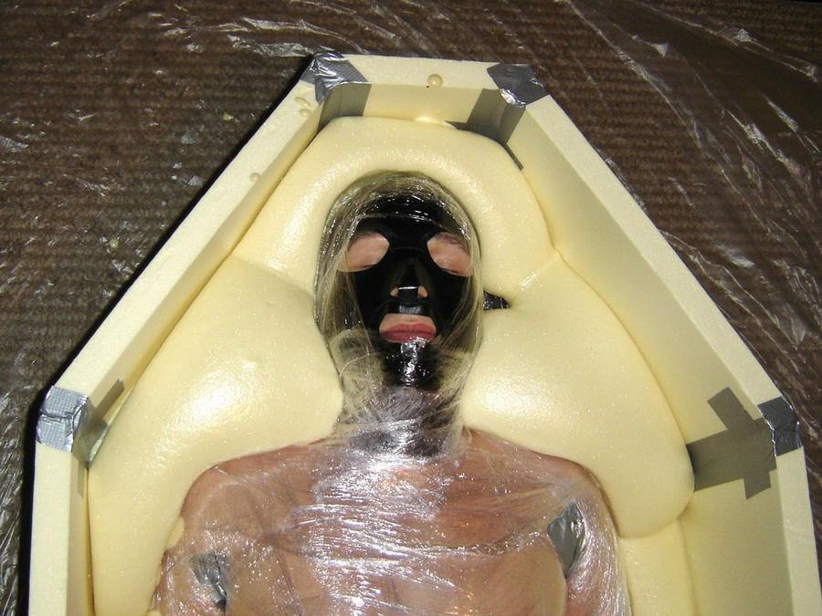
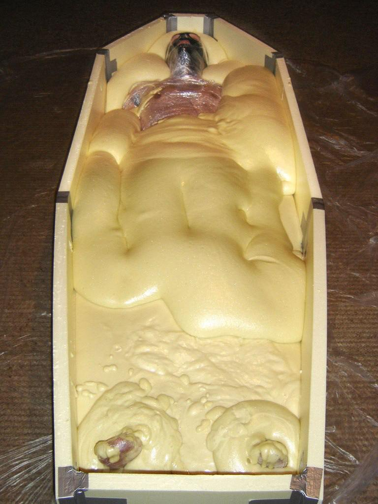
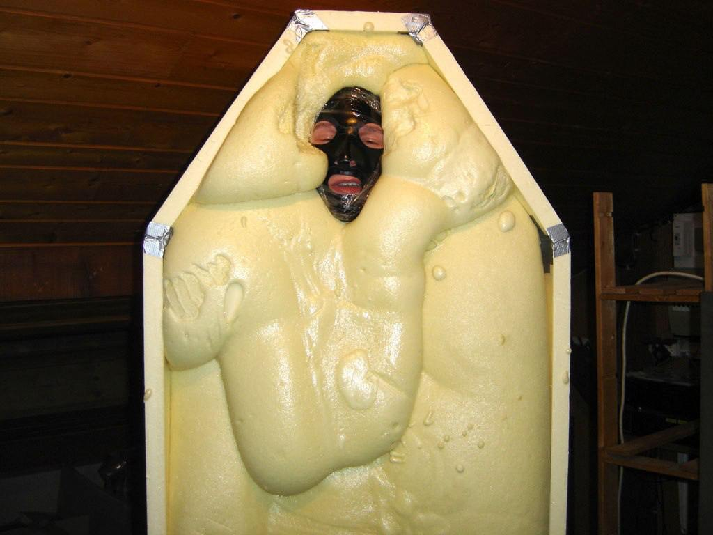
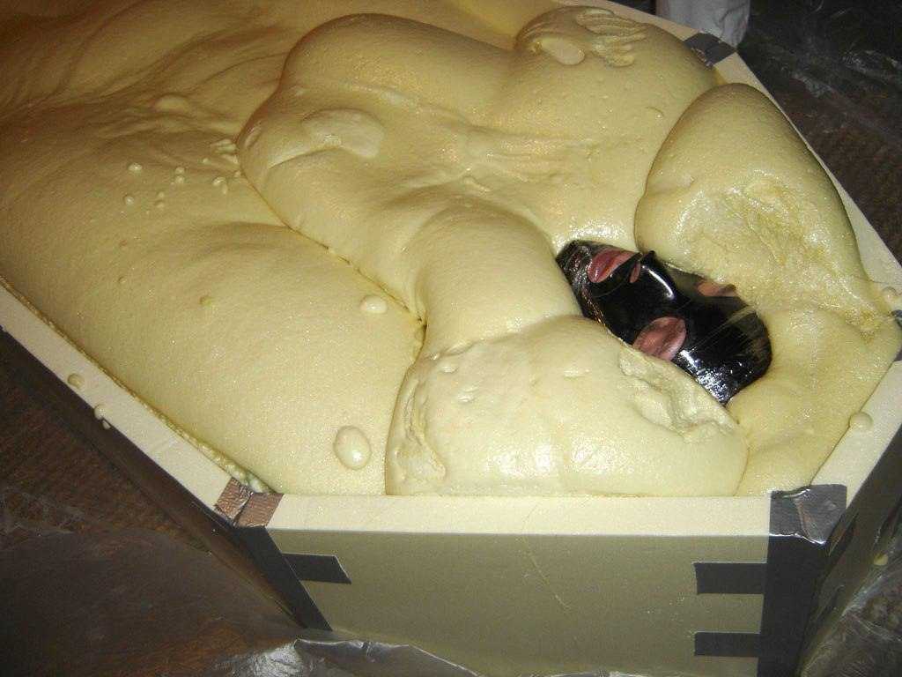
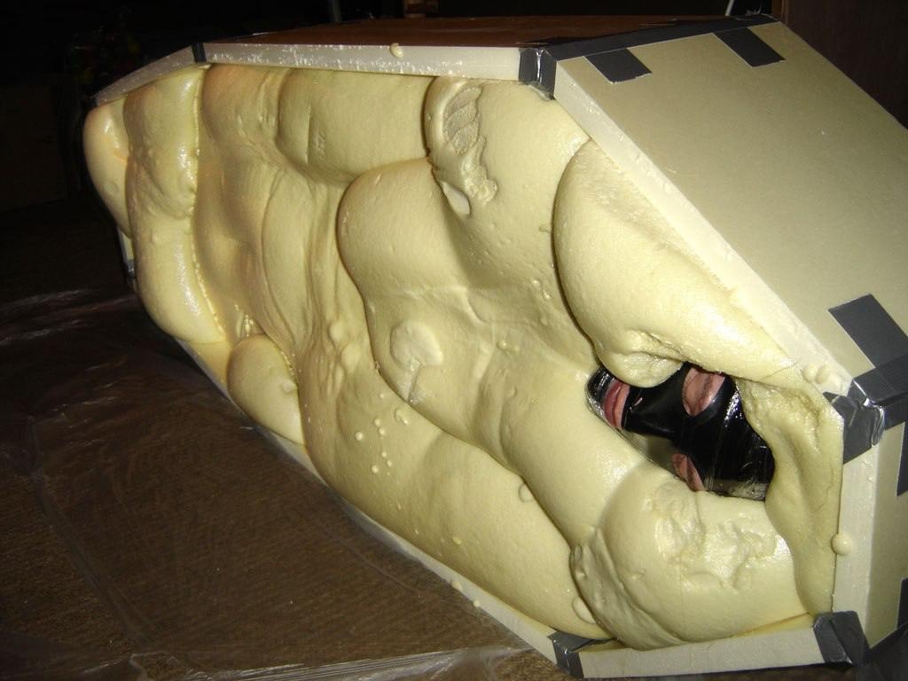

強制拘束 - 聚氨酯發泡膠
=====
對重度固化play有興趣的人，也許會看過這個特殊的短片。常用於冷氣工程常用的隔熱發泡膠，噴出後兩三分鐘內就會固化硬化，進而把人完全困在固體中

警告：這是一個高度風險的玩法，可能造成「燙傷、抽筋、恐慌、甚至死亡」等傷害，安全第一請勿輕易嘗試

## 參考
https://www.deviantart.com/strangehobbies/art/Foam-Encasement-1-292041599

## 媒體

## 風險：
- 發熱：溫度可以到達40度或以上，長時間持續可能會引發低溫燙傷，尤其在末稍處如手腳指。由於氣泡膨脹的關係，發泡膠本身有很好的隔熱特性，接觸皮膚的熱量大致上還是可以被身體帶走的程度。但要特別留意，盡量發泡膠攪拌20秒以上，看見有膨發之後才倒入。未膨發的滲透力很好，會把熱量帶入縫隙中，會燙很多
- 接觸過敏：直接接觸肌膚可能造成過度刺激與過敏，拆除時亦可能對肌膚造成傷害。若要直接接觸肌膚請務必先在手臂上進行測試。
- 體毛：發泡膠會咬住體毛導致拆除時被「拔毛」，會非常痛，如果要直接接觸肌膚，請務必先除毛
- 肢體姿勢：這是固化play，若姿勢不良沒辦法改變調整，而拆除可能會需要數分鐘以上。請務必確保可以使用舒適的姿勢，並預先準備好快速拆除的工具
- 直接接觸皮膚的話，拆除後會殘留一層PU塑膠於皮膚上，要一兩天才會逐漸脫落，尤其是指甲特別會黏，小心不要拆的時候拉太大力弄傷指甲。

從這邊的描述可知，直接接觸肌膚會是非常麻煩且增加風險的。請盡可能使用保鮮膜、塑膠套之類的東西先對肌膚完成保護措施會簡單許多

## 材料與工具
- 聚氨酯PU發泡膠，分成噴罐型與AB劑型，噴出/混合後會產生CO2氣泡膨脹，兩三分鐘內就會固化硬化並且發熱
  - 若只要固定手腳，買AB各一公斤的版本綽綽有餘，但若全身固定則至少要五倍以上
- 可量測適當重量的電子秤
- 500ml以上的免洗飲料紙杯，因為不會一次倒完建議多準備幾個
- 拋棄式攪拌棒，應與紙杯高度匹配
- 作為澆注模具的紙箱
- 重要：電動石膏鋸
- 一字起子
- 修整用的刀片（切記勿直接對有人體的區域操作，可能造成嚴重傷害）

### 電動石膏鋸
電動石膏鋸是一款「靠震動」切割硬脆物體的工具，特點是「不會弄傷柔軟堅韌物體」如肌膚。對切割硬泡棉、石膏等物體有奇效，不小心碰到肌膚不會受傷，甚至可以當按摩棒來用（？）。雖然在台灣多被視為醫療用品，但是淘寶賣的很便宜

缺點是刀刃的切割深度受限，切割的時候應一片一片切割後用手扳斷，或者塊狀切割後用一字起子撬起

### 聚氨酯PU發泡膠
原理：多元醇、異氰酸酯、水，異氰酸酯與多元醇反應生成聚氨酯主鏈，同時與水或其他發泡劑反應產生氣體。

異氰酸酯可能為 二苯基甲烷二異氰酸酯（MDI） 或 甲苯二異氰酸酯（TDI），都有生物毒性，所以盡可能不要直接接觸肌膚，絕對不要接觸黏膜

操作溫度盡量在25度以上避免反應緩慢

- https://shop.dechemical.com.tw/product.php?pid_for_show=4480
- https://www.ruten.com.tw/item/show?22410940843838=&srsltid=AfmBOoqGbUs0XMVM-dqD7RV7cDiQC0GZgj6y-efX2rR6timkG03eOgKI

## 安全措施
* 盡可能不要讓身體直接接觸到，如果一定要，有毛髮處最好剃光，上一層植物油/嬰兒油，或使用膠膜/矽膠泳帽保護。
* GG使用保險套+保鮮膜保護，或避開GG。
* 過程中需時時留意溫度與受試者溝通，發熱可能會造成燙傷，厚度不得超過1cm

### 緊急措施

若不慎眼睛或其他粘膜處接觸石膏，請立刻終止遊戲，在最短的時間內護送至水龍頭下持續對患部沖水數分鐘後評估狀態。

若為眼睛，沖水時請想辦法翻起上下眼皮，盡量讓可能沾染的區域都有被沖到，然後去醫院檢查。石膏產生的強鹼可能會灼傷角膜，是否有傷害或應如何護理應由醫師檢查判斷。

若不慎嗆入石膏水，若僅在鼻腔，想辦法咳/鼻水之類的方式將其排除身體，並去醫院。若嗆到更深處，請撥打以最快的速度前往醫院進行急診
