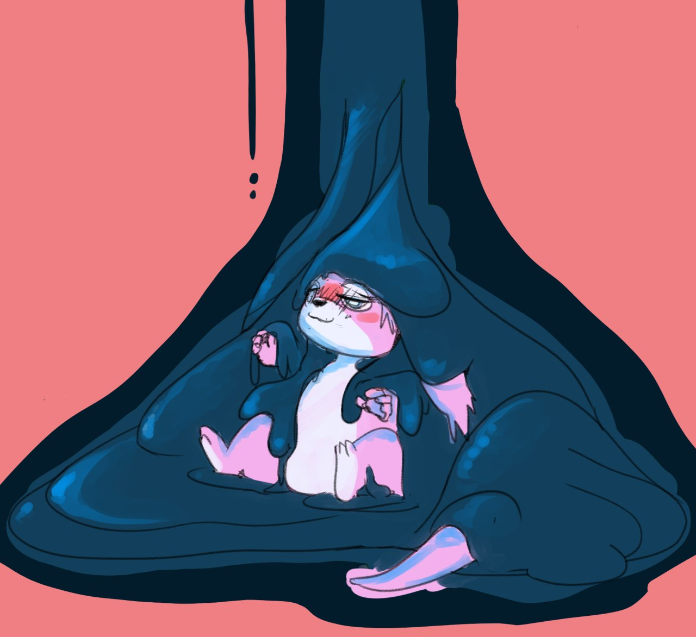

黏液浴
=====

[線上投影片](https://stickysli.me/FurMIT2023.pdf)，或者關注預約 [StickySlime](https://stickysli.me) 工作室的 史萊姆體驗活動

小時候聽童話故事中，小豬仔能夠在泥巴坑中自由打滾，總是有種莫名的憧憬在。也曾因為洗澡身上滑滑的觸感很棒，在浴缸中溜過來滑過去很有趣，所以傻傻的拿了半瓶沙拉油來玩，最後清理的時候真的超級悲劇😂

大學的時候學會了調製「太白粉史萊姆」這種天然滑潤且容易清理的黏液。準備一百公升左右沖泡在浴缸中，淡淡的地瓜香，除了觸感舒適外，吃到也毋須擔心，反而是留下一絲甜味。一邊以觸覺感受與伴侶的互動，一邊品嚐對方身上各個部位，我想這是相當有情趣的一種體驗。

若是愛好觸感的朋友，穿Zenati或乳膠衣下來玩也是很讚的體驗！

有去Hunt（台北Gay bar）的朋友應該也有聽說過 [黏液摔角](https://www.youtube.com/watch?v=0Wzqk2XvZbo) ，跟土耳其的塗油摔角有點類似不過更趣味一些，只是舉辦的時間很短暫所以要多去詢問

## Tags

#ぬるぬる #ネバネバ #ねばねば #messy #gunge #slime #スライム #splatoon3 #粘著拘束 #狀態變化 #mummification #固め 

## 影片與資源

- [南韓泥漿節](https://dq.yam.com/post.php?id=915)
- [西班牙番茄節](https://www.tripresso.com/blog/2018/08/西班牙番茄節/)
- [土耳其 橄欖油摔角](http://tkturkey.com/土耳其老祖先運動油脂摔跤上/)
- [Youtube影片: 小女孩與貓與史來姆入浴劑](https://youtu.be/P-XfCbVVjKE?t=337)
- [Youtube影片: Squishy Slime Baff !!! Super Gross](https://www.youtube.com/watch?v=Kkb7xdXINLc)
- [Twitter: 制服 X 史萊姆黏液](https://twitter.com/yurise_x/status/1259135451522162689)
- [Twitter: 泥漿浴](https://twitter.com/wamlanta/status/1261765089201459202)
- [Youtube: 白濁史來母池](https://www.youtube.com/watch?v=MfIhnkdeZsw)
- [Youtube影片: 第一場夏日史萊姆party紀錄短片](https://www.youtube.com/watch?v=zoqEFGsIGpk)
- [R18圖：KIYO 浸泡](https://www.pixiv.net/artworks/77613287)
- [R18圖：うる スライムに](https://www.pixiv.net/artworks/78694060)
- [繪師：taramin](https://www.pixiv.net/users/1186456)
- [繪師：silkyfriction](https://www.pixiv.net/users/4372252)

## 材料

我推薦使用 [Inst-Slime 即溶史萊姆入浴劑](https://shop.stickysli.me/products/inst-slime-10l)，這應該是目前最簡單又漂亮的做法了。   
希望黏性更強可以使用 [Inst-Sticky 超黏史萊姆入浴劑](https://shop.stickysli.me/products/inst-sticky-10l)，   
亦有食品級材料配方 [Inst-Muchi 史萊姆入浴劑](https://shop.stickysli.me/products/inst-muchi-1l)，   
以及目前最熱門，適合拍沙龍的超牽絲[Inst-Stringy](https://shop.stickysli.me/products/inst-stringy-1l)，   
與冬天適合泡溫泉的[Inst-Pool](https://shop.stickysli.me/products/inst-pool)   
如果喜歡潤滑液摔角這種大量潤滑液的場景，[Inst-Sticky 超黏史萊姆入浴劑](https://shop.stickysli.me/products/inst-sticky-10l)用在30L水可以瞬間變出超大量潤滑！

### 自制太白粉勾欠

若要使用身邊的材料，太白粉勾芡算是成本最低又容易取得的一種方案了，做法也相當簡單：太白粉適當加冷水調勻成粉漿（粉量決定濃度），煮滾水（飲水機也行）置於臉盆內（溫度90-100度之間），一手拿筷子攪拌，另一手將粉漿均勻注入熱水中，拌勻即可。常見的失敗點：粉漿沒有拌勻導致結塊、熱水溫度降低了所以無法充分糊化粉漿、以及忘記關火燒焦鍋底之類。

如果只是單純做肌膚潤滑，也許一公升左右足夠了（一公升水＋100公克太白粉），不過如果想在浴缸甚至充氣泳池裡玩，我覺得10-20公升更為盡興。

除了剛剛提到的太白粉，巧克力醬大概是最常聽說的情趣甜點了。使用巧克力醬、蜂蜜、鮮奶油在伴侶身上好好裝飾，然後再美味的享用，本身就是讓人興奮的一件事。

太白粉製造的黏液的特性就跟我們常見的勾芡濃湯是一樣的，黏黏滑滑，但是不怎麼牽絲（沒有延展性）。若希望有較好的牽絲效果，除了上述的[Inst-Sticky 超黏史萊姆入浴劑](https://shop.stickysli.me/products/inst-sticky-10l)與[Inst-Stringy](https://shop.stickysli.me/products/inst-stringy-1l) ，也可以考慮 [黏液繭](slime_cocoon.md)

Update 2021/07/10: 美國Youtuber的做法，泰勒粉+J-Lube+顏料 https://twitter.com/DucTapeDummy/status/1292999905737400321?s=20

Update 2025/04/07: 可愛的gooeypony公開了他的黏液配方: Tylose HS 100000 or 60000 HEC + J-Lube https://gooeypony.com/gunge-hec/

## 調味與調色

繽紛色彩的碰撞也是英國Messy的醍醐味！ 我們提供 [Colorful Messy party](https://shop.stickysli.me/products/colorful-messy-party) 讓你輕鬆開趴

或者可以去食品材料行購買食用色素、使用先天有色彩的食材如麵粉、巧克力醬、番茄糊等，有時我會太白粉糊加入一點糖與液態鮮奶油，會有種「焗烤馬鈴薯」的那種香甜氣息。

## 裝備

- [充氣游泳池](https://mall.pchome.com.tw/prod/CAAE8I-B90053M7Y?fq=/S/QFASC1) 很適合用來建立臨時的遊戲空間，例如陽台、客廳等地方，或者放在床上柔軟舒適。記得根據你的可用空間找適當尺寸的游泳池喔
- [拋棄式防塵布](https://24h.pchome.com.tw/prod/DEAC6H-A9008ZOFG) 我們很建議先用這個把遊戲空間周圍先貼個一輪，包含牆面、地面與走道，一路貼到浴室去，這樣活動結束後只要撕起來，一切都乾淨溜溜 [用法影片](https://www.youtube.com/watch?v=XEmwGlEeo8o)
- [zentai](https://find.ruten.com.tw/s/?area=0&cateid=0005&platform=ruten&q=zentai&shipfee=all) 若不喜歡「坦誠相見」，或是想要不一樣的觸感，除了穿泳衣之外，也可以考慮全包式緊身衣Zantai。

參見 [舉辦成功的Party](https://shop.stickysli.me/pages/host_a_nice_party)

## 清潔

清潔的時候也很簡單，用水沖就可以沖掉，就算有黏著的部分，使用肥皂搭配洗澡用的浴球就能輕易去除，不用擔心毛髮沾黏。

如果真的弄的很濃無法流入下水道，可以考慮 1.沖水稀釋 或 2.用手捧起集中於桶子，然後送廚餘回收/沖馬桶

切記有油脂的材質（如巧克力醬）不可沖入水管，會造成很難纏的堵塞

[更多清潔說明](slime_cleaning.md)

[清潔指南](https://shop.stickysli.me/pages/cleaning)