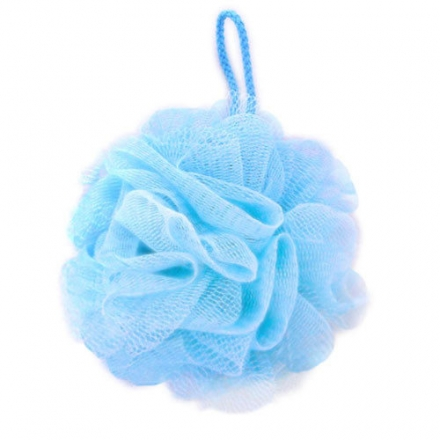

黏液清潔 / 場地選擇
=====

## 清潔難度比較

黏液繭 < Inst-Muchi < Inst-Slime < Inst-Sticky < 黏鼠膠

## 準備

* 必要
  * 大小毛巾（遊戲中沾到臉上時可以抹掉、亦可鋪在地面防滑、洗澡時亦可取代菜瓜布發揮奇效）
  * 沐浴乳或肥皂
  * 菜瓜布或沐浴球
  * 大塑膠垃圾袋
* 選用
  * 刷地用的刷子（可以用菜瓜布替代）
  * 洗背用的長鬃刷
  * 清潔劑：過碳酸鈉（刷地、洗衣可有效去除黏液）
  * [養生膠帶](https://www.google.com/search?client=firefox-b-d&q=%E9%A4%8A%E7%94%9F%E8%86%A0%E5%B8%B6) / 帆布 / 塑膠泳池 / 普通寬膠帶

## 場地選擇

遊戲區域首選自然是浴室，而擁有大浴室的Motel自然是很棒的地點，方便設置充氣泳池也好清洗，同時可以停車也方便運送各種器具與材料，就是貴了點。一般建議使用過夜的方案，讓你有充足的時間可以佈置場地與清潔，三小時的休息方案有點太趕。

普通旅館很常會遇到浴室不夠大的問題，雖然可以鋪設養生膠帶來擴大遊戲區，不過因為缺乏清洗泳池的空間所以能使用的玩法也會受限。

至於多人活動時可能會遇到，活動結束大家都想洗澡，但浴室只有一間的窘境，這個時候較大的浴室/浴缸/多淋浴間會有幫助

另一方面冬天因為很冷的關係，你可能會想要準備電熱器與電毯，不過要特別注意這些都是不能碰水的，尤其是電熱器的熱度可能會造成正前方的物品烤焦或引燃，需要特別小心安排。選擇已經有加熱空調的旅館依舊是比較好的選擇。

最後請務必在活動結束時盡量讓場地恢復原狀，給場地方一個方便，也是給我們黏液玩家日後遊戲有更多選擇。

## 個人清潔

* 普遍來說建議預留15-60分鐘的洗澡與清潔時間
* 先用手刮除黏在身上的大塊史萊姆與黏液，可以大幅簡化清洗的難度
* 若黏滑的史萊姆附著於皮膚上，使用菜瓜布、沐浴球等多孔材質可以有效刮除。
* 當沐浴球本身也變得黏糊時，沖水揉搓將黏液洗去後即可繼續使用
* 肥皂、沐浴乳可以有效避免已經洗下來的黏液黏回身體
* 溫熱的清水可以加速沖走黏液
* 若環境允許，保留一個裝滿溫熱水的浴缸用於搓洗身體可以很快速地清除身上的黏液

### 細說清潔原理

史萊姆的材質事實上是水溶性的膠體，甚至很常被使用在清潔用品中，理論上都可以靠沖水清潔去除，但為什麼還是不好洗呢？

清潔不易的主要原因不外乎 1.貼身 2.黏性 ，即便可被水溶解，但是一方面成團之後，每次沖水都只能去除表面一層，底下依然溼滑; 另一方面黏在皮膚上不容易大塊大塊去除。

目前唯一可以整塊撕除的產品是黏液繭，因為本體交聯的特性，膠體之間的連結程度大於與皮膚的連結，所以即便又黏又稠，反而是最好清洗的，只要先把身上大塊的黏液抓起來放旁邊，頭髮沖水搓揉把縫隙間搓出來，剩下沖沖水正常洗澡就可以解決

而黏鼠膠則是水溶性材質，我推薦先在浴缸準備一盆熱水，直接泡下去揉搓身體，用熱水可以有效的軟化與溶解

目前為止最難處理的Inst-Sticky，基本上只要遵循 1.刮除大塊黏液 2.用肥皂避免黏液重新黏回身體 3.使用大網目的入浴球幫助從皮膚上把黏液刮起來 就可以快速地清除。

刮除身上黏液，我都用手刀，如果有類似這種的[矽膠刮刀](https://www.muji.com/tw/products/cmdty/detail/4945247109139)也可以使用

建議沐浴球不建議使用網目較細的，因為細的孔徑容易包含黏液，導致很快沐浴球也變得黏滑滑的，失去了清潔效果，此時把沐浴球沖水搓洗幾下即可快速去除黏液可繼續使用

## 環境清潔

準則只有一個：盡量避免讓黏液碰觸到不該碰的地方，例如沾染到水泥漆的牆壁很容易黏著變得難以清洗，床墊地毯也是。由於遊戲時很容易打鬧，把黏液甩出去噴在牆壁的情況並不少見，所以會建議使用拋棄式塑膠布（養生膠帶）把所有能遮蓋的範圍都遮蓋起來。

很多時候到了現場才發現浴室不夠大，會想把遊戲範圍延伸到周邊地區如床上，我會這樣做：使用養生膠布把周邊的牆壁都保護起來，其次是床本身，連接浴室的通道與牆壁也都要確保被完整包覆。養生膠帶拉下之後的末端沒有黏性有時會在走路時被黏起來，所以記得要使用普通膠帶加以補強，最終在床上放上充氣泳池，然後泳池內視情況再做額外的保護。

活動結束時，先使用桶子將大多數黏液撈去浴室稀釋沖掉，充氣泳池搬到可以沖洗的區域沖洗處理，然後從末端一路把養生膠布拆回浴室以避免黏液的沾染擴散，就可以很快速的讓場地復原。

養生膠帶使用需注意，本身為黏膠，若該環境的牆壁存在油漆斑駁可能脫落的情況，需要謹慎使用，在拆除時黏膠把油漆一起扯掉是可能發生的。

泳池的清洗是一個痛苦的過程，尤其是高黏度的版本。所以如果是空間不足展開泳池清洗的情況會變得滿辛苦的。高壓水槍、沐浴球我覺得是不錯的組合，先噴掉大面積的黏液，然後用沐浴球配清潔劑刷洗表面，最後沖乾淨晾乾。如果口袋夠深，把充氣泳池作為消耗品直接拋棄也是一種選項。

切記有油脂的材質（如巧克力醬）不可沖入水管，會造成很難纏的堵塞，可以考慮裝桶/塑膠袋後作為普通垃圾丟棄