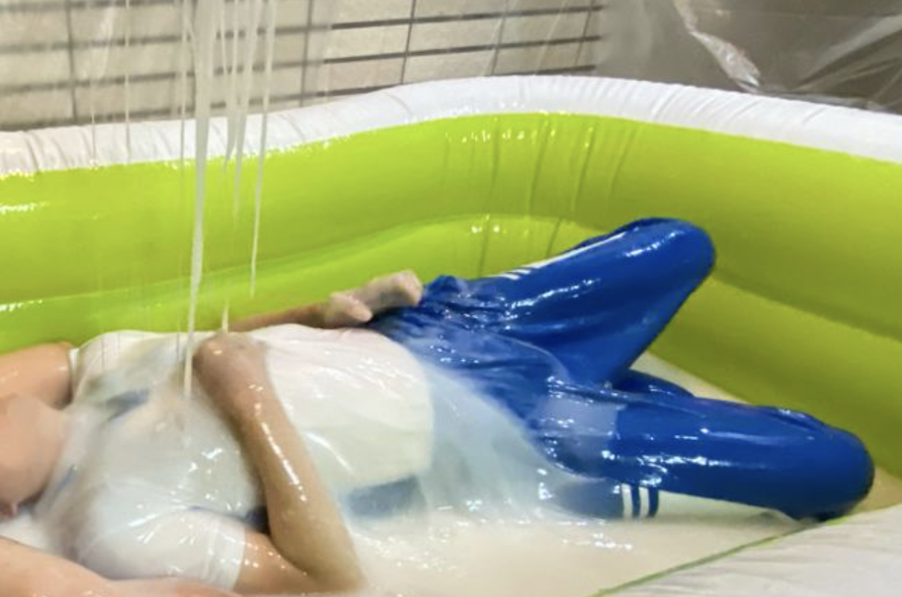

黏液繭
=====
最早是來自日本的玩法，透過幾種市售的膠狀物混合出極度濃稠粘膩，近乎蜘蛛陷阱般的純白史萊姆，由於被包裹後彷彿結繭等待羽化的蝴蝶，因而得名。

與重視互動的[黏液浴](slime_bath.md)不同的是，極高的黏度帶來的奇特觸感是相當個人化的。對普通人來說這是一種「有趣好玩」的新情境，而對愛好拘束玩家來說，則多了一種難以抗拒的新樂趣 - 又像是落入黏著陷阱中的可憐蟲，又像是被吞食入腹，無法掙脫的犧牲者。

黏液繭由於本身的高黏稠度，單人可以享受被拘束黏著的快感，而多人時則會比較偏向「打打鬧鬧、互相攻擊」的模式，除了製作比較困難以外，適合任意人數與各種年齡層的朋友。

由於製作上的複雜度與短效期，想體驗黏液繭請來預約 [StickySlime studio](https://shop.stickysli.me/pages/rent) ，或私訊我討論

## Tags

粘著拘束、Vore、丸吞、ネバネバ、ねばねば

## 影片與資源

- [Twitter: 日本黏液繭照片](https://twitter.com/nebachoco/status/1190994999350923264)
- [Twitter: 日本黏液繭製作與遊戲影片](https://twitter.com/waniuroko/status/1206581130813554688?s=20)
- [Twitter: 日本黏液繭照片（黑膠）](https://twitter.com/nebachoco/status/1208013539425734659?s=20)
- [Twitter: 日本黏液繭影片（黑膠）](https://twitter.com/nebachoco/status/1227620216516931585)
- [Twitter: 日本黏液繭影片（著衣）](https://twitter.com/nebachoco/status/1183631384478285826)

## 玩家心得

- [黏糊糊的史萊姆Play by Raki](https://www.pupraki.com/blog/gunge-slime-play/)

## 材料

日本的黏液繭配方雖然沒有公開，但是從Twitter上公開的照片可以推算出材料有 [ケイコー糊](https://www.monotaro.com/g/01010482/) (糊化的澱粉)＋[ケイコーのり](https://www.monotaro.com/g/02653206/) (PVA) 4.3:1，然後加入眼藥水（硼砂）進行交聯反應，最後拌入刮鬍泡來產生純白且蓬鬆的效果。

不過可惜不管是ケイコー糊還是ケイコーのり都不是台灣買得到的東西，從日本進口也太過昂貴了，看起來台灣已經不流行「漿衣服」，只好自己來了。PVA台灣長春化工有生產，也可以購買大罐膠水來進行調配，而糊化澱粉事實上就是「勾芡太白粉」，請參考[黏液浴](slime_bath.md)。硼砂可以從藥房購買，刮鬍泡則更好找了，你可以選擇你偏好的香味來挑選。由於每一種原物料的濃度配比不盡相同，所以自行調配記得要多準備一些來測試比例。

當然你也可以更輕鬆地直接選擇沖泡更簡便的 [Inst-Sticky 超黏史萊姆入浴劑](prod_inst_sticky.md)。

2021/11/20 update: 如果你現在住在日本，大創已經將 ケイコー糊 與 ケイコーのり 納入百元均一的範圍，且宅配到府運費也變得超便宜，所以在日本要玩黏液繭更輕鬆了！

## 調味與調色

黏液繭因為刮鬍泡的關係，純白的泡沫與刮鬍泡的香氣是很鮮明的，食品級色素或活性碳可以輕易的改變色彩，但是氣味就不是很容易調整了。

## 清潔

黏液繭本身事實上是水溶性的，而且PVA交聯後變得更加有黏性，所以可以輕易的從身上搓掉/拉除。我會推薦先用手把黏在身上大塊的黏液剝除，然後與黏液浴一樣，沖水＋肥皂＋浴球就可以輕鬆清除剩下的部分。

殘餘的黏液用手收集之後放入桶內整桶當垃圾丟棄，少量的則一樣用肥皂＋菜瓜布＋沖水洗掉排除即可

[更多清潔說明](slime_cleaning.md)

## 其他注意事項

PVA基本上是一種接近塑膠的材料，沒有人體毒性但也不會被消化; 進行交聯反應的「硼砂」則不可內服，但是其消毒效果廣泛應用於眼藥水、粘膜的消毒上; 而刮鬍泡基本也不是什麼適合吃的東西，所以雖然安全無虞，還是小心不要吃到它了。

需要特別小心的毫無疑問只有一件事，就是千萬要維持呼吸道暢通。高稠度的黏液不小心吸入的話是很危險的，所以手邊一定要多準備幾塊毛巾，在口鼻被覆蓋時，可以即時抹掉。如果有搭配穿著Zentai下去玩的話，建議口鼻剪開，以避免被覆蓋之後無法呼吸。
