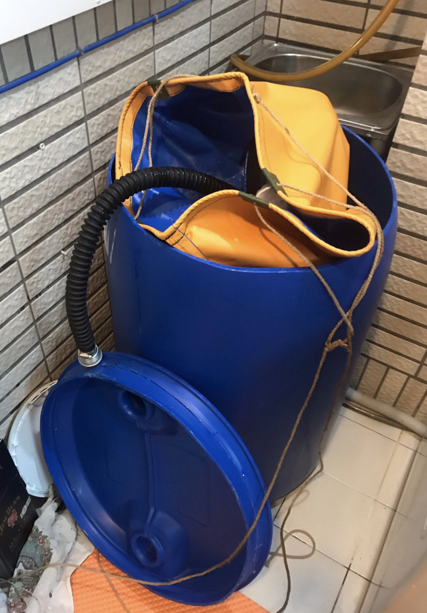
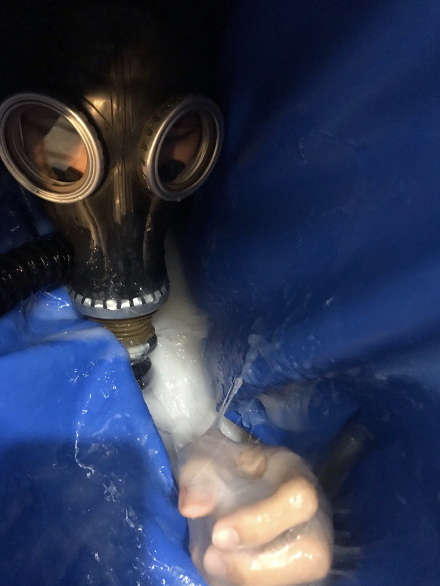
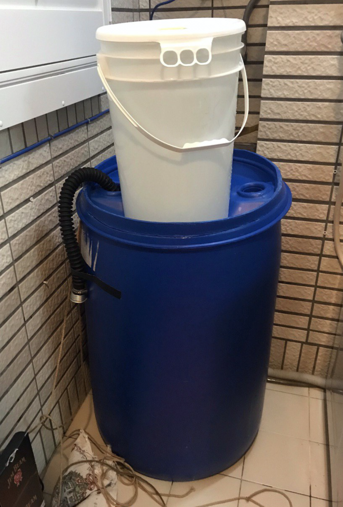
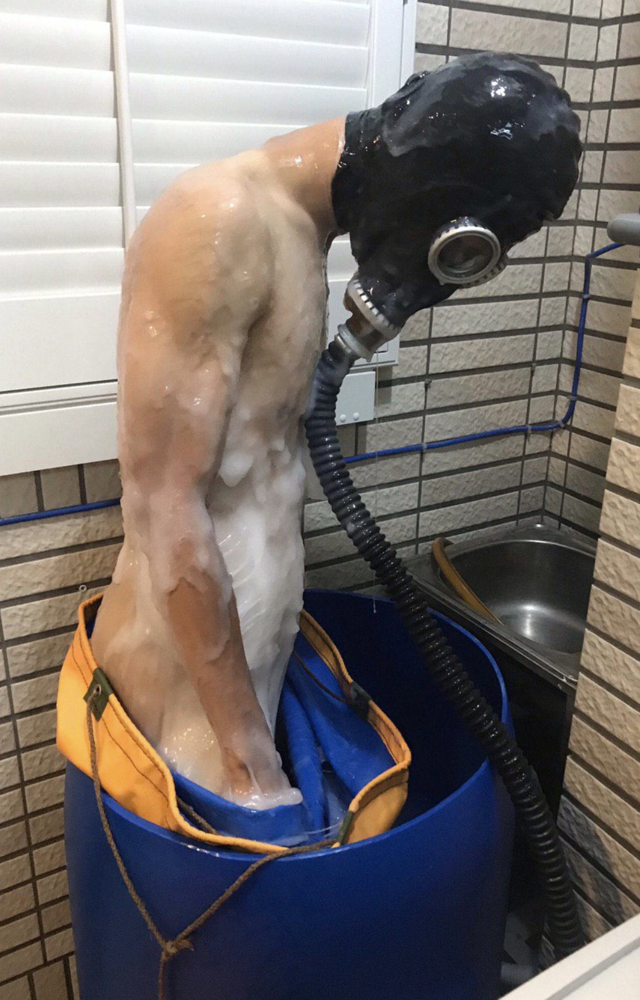

史萊姆水牢
=====
「被巨大怪獸吞下之後，被困在體內被產卵/侵犯」之類的主題在日系R18作品中屢見不鮮，可謂定番。
誤入蟲子的巢穴，四肢被固定於精液池中被蟲子當成繁殖的苗床也是經典的主題。
那種無助、墮落、被低等生物當成繁衍的工具的刺激感沒有什麼可以相提並論。

也許我們沒辦法真的被什麼巨獸吞掉，但是也許我們可以弄一些「有趣的模擬情境」來讓你感受「被吞沒束縛」的特殊感受。
特製的帆布袋模擬胃壁，其中倒入高年度的厚重白濁黏液，讓你黏在其中難以掙脫，只能透過那細長的呼吸管獲得新鮮空氣。
厚重的水壓灌入桶內，一百多公斤的重量擠壓著袋子，擠壓著你的身軀，緊張與無助的情緒瀰漫著，也許就這樣成為苗床的一份子了？
感受著腹部的卵的騷動，這樣的念頭難以平息...

這會是一個需要夥伴協助的玩法，要擺下200L大桶子也需要一點空間，對一般人來說實踐的難度比較高。
如果有興趣的話，可以[與我們聯絡](http://stickysli.me/index.html#contact)預約體驗

## Tags

粘著拘束、Vore、丸吞、苗床、真空包裝、精液漬

## 影片與資源

## 設備

* 200L大塑膠桶
* 訂製防水帆布袋，或可束口之大型塑膠袋2-3個套在一起（要小心別掙扎時弄破了）。尺寸至少需要有大塑膠桶的深度，以及人蹲進去可以束口的大小
* 膠帶一捲（將呼吸管出口黏在桶外，避免滑動接觸到水）
* 水龍頭與水管，負責對桶內注水增加壓力，天氣冷可以用溫水更舒適，但水溫別太高。

安全措施

* 蘇聯防毒面具GP-5m，或其他可連接呼吸管的潛水面罩。 雖然也有口咬呼吸管的選項，但要特別留意呼吸管的長度會影響能夠吸到氧氣的程度，務必事先測試能否長時間支持。若有呼吸管，就可以束緊帶口蓋上蓋子，體驗完全被封閉的感受。
* 無線門鈴一組，按鈕用塑膠袋封好避免進水，由受試者握在手裡，室內機（鈴聲）則放置於附近乾燥處。

緊急狀況時受試者捏按按鈕，主控者聽到鈴聲響起則必須無條件解除束縛，讓受試者脫離桶內並可以呼吸新鮮空氣。受試者也可以嘗試自行站起並拉開袋口脫困。

主控者必須時刻維持清醒，並且不可遠離至視線或聽覺無法傳達之處。EMT剪刀與相關工具必須隨時在身邊待命。為了避免黏液阻塞呼吸道，主控者應學習哈姆立克法與基本人工呼吸。

## 材料

* [黏液浴](slime_bath.md)或[黏液繭](slime_cacoon.md)使用的黏液皆可，當然效果會略有不同。我偏愛使用[麻糬](http://stickysli.me/shop.html#starch-slime)搭配[黏液](http://stickysli.me/shop.html#pva-slippy)，麻糬會帶來大塊狀的顆粒觸感，而黏液提供很棒的貼合感。
* 黏液用量我覺得20kg左右是適合的，如果想感受更多的貼合感，也許可以先從10kg加起，不夠再加。

## 作法

不知道有沒有做過舒肥料理的朋友？準備醃醬，將肉充分按摩以入味，然後放入真空袋中，浸泡於溫水等待熟成。某些程度上，我覺得這是很性感的動作。

史萊姆水牢的基本原理大致上也是差不多的。準備好黏液（也許再調個味？），將受試者裝入袋中充分裹上醃料，然後注入溫水排氣，袋內被水擠壓到接近真空，黏液與袋子緊密貼附在身上後，封口加蓋熟成個一小時，等待被主人享用。

如果不夠刺激，也許像火雞一樣，也在受試者裡面填塞一點醃料？也許塞點蛋跟馬鈴薯泥？肯定會更加美味的。

## 調味與調色

麵粉可以將顏色變得白濁，而活性炭或食品色素可以染黑或其他顏色。我個人還是偏愛液態鮮奶油。

## 清潔

黏液本身事實上是水溶性的，我會推薦先用手把黏在身上大塊的黏液剝除，然後與黏液浴一樣，沖水＋肥皂＋浴球就可以輕鬆清除剩下的部分。

殘餘的黏液用手收集之後放入桶內整桶當垃圾丟棄，少量的則一樣用肥皂＋菜瓜布＋沖水洗掉排除即可

[更多清潔說明](slime_cleaning.md)

## 其他注意事項

相對於一般玩法，裝入桶內之後由於外界看不到內部，要掌握受試者是否安全變得不太容易。除了提供緊急通報的鈴聲按鈕外，適度的搖動桶子並探詢受試者的狀態是很重要的，如果沒有回應的話還是得要趕快把人拉出來 - 即便可能只是睡著了，但確保安全依舊是最優先項目。