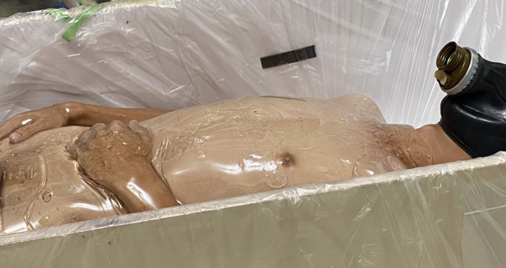
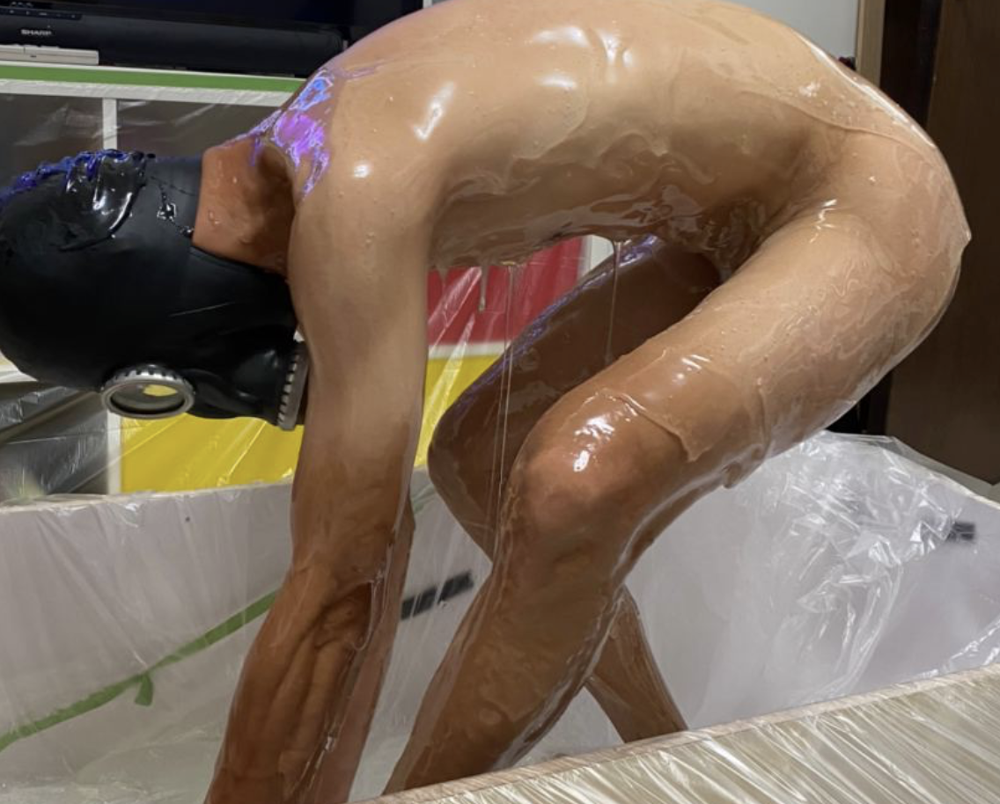
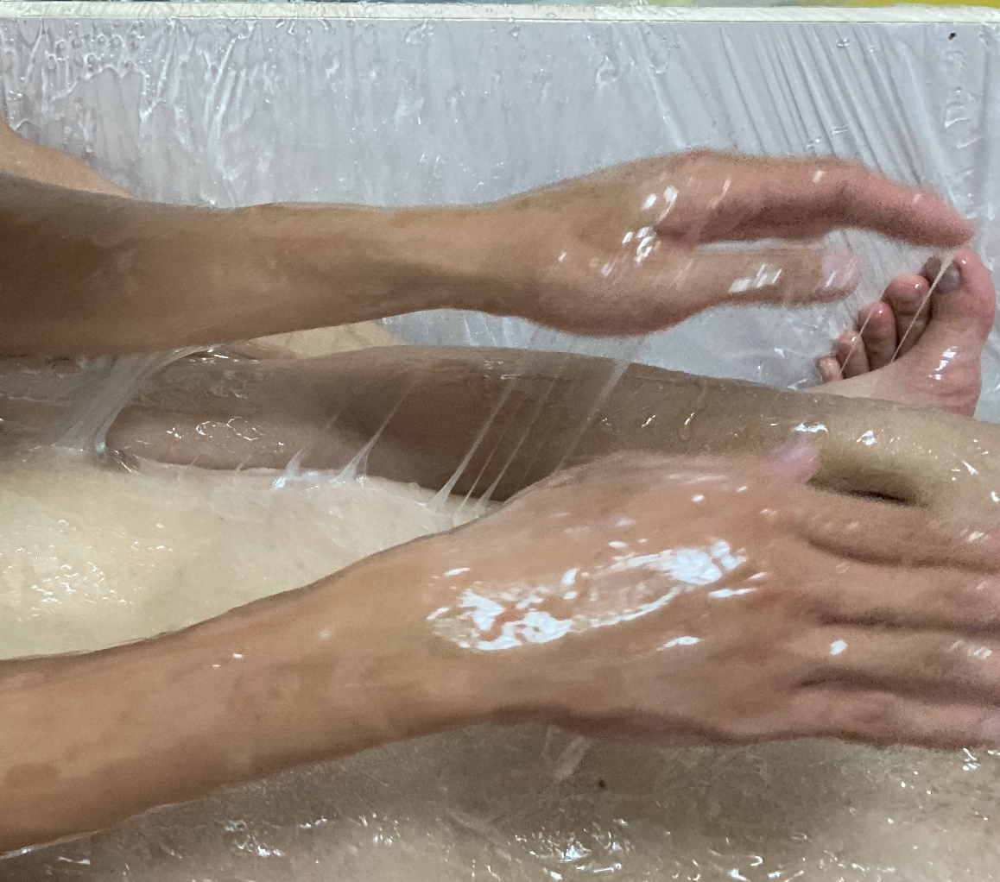

黏鼠陷阱
=====

覺得[黏液繭](slime_cocoon.md)還不夠束縛與刺激？想體驗真的被黏在地板上動彈不得的危機感？來看看影片吧

體驗之後覺得是一種適合拘束類的玩法，不適合多人互動，每個動作的阻力都太強大了（笑

## Tags

粘著拘束、ネバネバ、ねばねば

## 影片與資源

- [短漫：巫鷹 巨大肉食植物](https://www.pixiv.net/artworks/75498979)
- [短漫：巫鷹 スライムトラップ](https://www.pixiv.net/artworks/58654342)
- [pixiv: higawariJelly](https://www.pixiv.net/users/691778)
- [使用黏鼠膠的Hardcore玩法](https://twitter.com/B6uKyyp3bVTB1Dr/status/1217088671624527872)
- [同上，露點R18注意](https://twitter.com/B6uKyyp3bVTB1Dr/status/1219177925762670594)
- [Youtube影片: 泡進227公斤的鍵盤史萊姆中](https://www.youtube.com/watch?v=f_KAUcRBlWs)

## 注意事項

長髮/長毛不適合這種玩法，小心變成現場拔毛live show

有包皮的人不適合脫褲下去玩，高黏度可能導致扯到皮導致痛到軟掉

千萬注意呼吸，吸進去不是鬧著玩的

千萬準備好周邊清潔，會洗到吐血

## 設備

可以考慮準備充氣游泳池作為場地，地面鋪墊拋棄式防塵布來減少污染。購買大塊的帆布，將四邊貼於地面也會是不錯的方案。本次採用木箱做容器，鋪墊四層防塵布。

## 身體清潔

推薦有浴缸的環境，事先放好熱水，麥芽糖出來之後直接泡進去，拿洗澡菜瓜布刷洗，可以15分鐘左右就清乾淨。相對比起一般淋浴可能要花到一個多小時，可以大幅縮減清潔的時間

在水中先把大塊的麥芽糖用指甲摳掉是快速清潔的方式

有毛的部分如頭髮，麥芽糖會導致黏成一團，可以泡在熱水中揉搓並使用手指分開，可以較快融解。不過依然不建議長髮的人沾到頭髮。

## 環境清潔

防塵布不要手軟，會經過的範圍地板、牆壁、門都要，麥芽糖超級會沾黏，會洗到吐血

防塵布必須用膠帶強化貼在地上，不然一黏就翻起來了

一定要準備抹布，沾到地上是必然的

離開時防塵墊可能會黏在腳上，可以橫向抹一下來避免沾黏

需要準備雙層大塑膠袋來收拾防塵墊，最後一個離開的人可以順手把防塵墊卷在自己身上，一路拖著到浴室

## 材料

上面影片中使用的是正統的粘鼠膠，推主表示是在[這裏買的](http://www.sumisu-t.com/items/01_nezumi.html)，不過高達[12100Yen 3.3kg](https://www.amazon.co.jp/チューチューピッタンコ-レギュラータイプ-3-3kg-ネズミ粘着剤-業務用とりもち/dp/B07YXSW16V/ref=sr_1_20?__mk_ja_JP=カタカナ&dchild=1&keywords=ねずみとりもちピッタンコ&qid=1595051477&sr=8-20)實在是買不太下手。

相對我選擇較為安全的材料是麥芽糖。一樣足夠黏稠且阻力強大，但是對人體安全、可食用，更容易水洗清除。你可以在[這裏找到23kg的大桶裝](https://shopee.tw/M86%E6%B0%B4%E9%BA%A5%E8%8A%BD5kg%E5%8F%A6%E5%94%AE%E6%B7%A8%E9%87%8D23kg%E9%90%B5%E6%A1%B6-i.3534891.18780885)，價格便宜得多。軟質麥芽糖與硬質麥芽糖各有千秋。

自製粘鼠膠據說是1份（質量比）的松香與1份蓖麻油(或桐油)混合後加熱熬成膠狀物製備，待測試

## 作法

訂購23-46kg左右的大桶麥芽糖，使用前可以先把浴缸充滿熱水後整桶不開封泡進去加熱軟化，不過如果是計時租用的空間可能就跳過這個步驟，因為軟化的時間要很長

遊戲場地要確實鋪滿防塵墊，一路延伸到浴室

最好有一個人幫忙淋麥芽糖，由於流速很緩慢所以需要一個比較有力的人用勺子或刮刀清理桶子會比較方便

好像就這樣ＸＤ





## 受試者心得
```
不過說是黏鼠板，我覺得比較像膠灌模(? 畢竟不是整個被黏住動彈不得，主要使用材料是麥芽糖！但認真說要在麥芽糖中移動也不是一件容易的事情，尤其是我身上沒有毛髮！就不難想像有毛髮的人黏到會有多精彩XD，總結下來，不太適合雙人玩弄(?)，覺得比較適合拘束用途，可以微微掙扎但卻依就動彈不得，就連出來也需要別人幫助才出的來啊。
```

```
剛踩在麥芽糖上一開始還可以把腳拔起來，但是接下來兩步馬上就黏住了，行動很吃力，各種牽絲。用手戳對方奶頭可以整個黏起來，然後牽絲，反覆就會變得像龍鬚糖一樣白白的ＸＤ
高黏度的情況下要撫摸主人並不容易，不過那個觸感也是相當有趣的。只是真的摸幾下就放棄了ＸＤ
在這種情況下如果想要幫對方嚕，除了對方不能有包皮外，也要使用大量的潤滑液去稀釋，不然黏黏的雖然擼得起來，但速度受限所以很難達到頂點。
想像著全身都被黏著禁錮在蜂巢，肚子被灌滿蜂蜜鼓脹如[蜜罐蟻](https://www.youtube.com/watch?v=vCcNG8p3Zwc)，被巢穴的生物們作為養料持續榨取，實在是一個讓人想挖洞鑽下去但又難以忘懷的體驗（掩面）
```

```
麥芽糖—玩人視角
箱子的空間對於玩人者來說可能有點擠，主要的姿勢為蹲或跪姿，也可以讓被玩的人躺在伸直的腿上。玩法以撫摸為主，在摸的時候會感覺到非常強的黏滯性。有一點要特別注意，當手離開沾滿麥芽糖的皮膚表面時，如果速度不放慢的話，很容易拉到皮膚而弄痛對方。

玩人的人通常也會沾滿麥芽糖，在移動方面也受到一點影響(會變得更緩慢)，如果是毛多的人，也很容易因為麥芽糖而扯到皮膚(痛)。總體來說，麥芽糖這類高黏度的物體比較適合拘束和禁錮，單如果不介意刺痛想和對方親密地黏一起的話，那也是沒問題的。
```