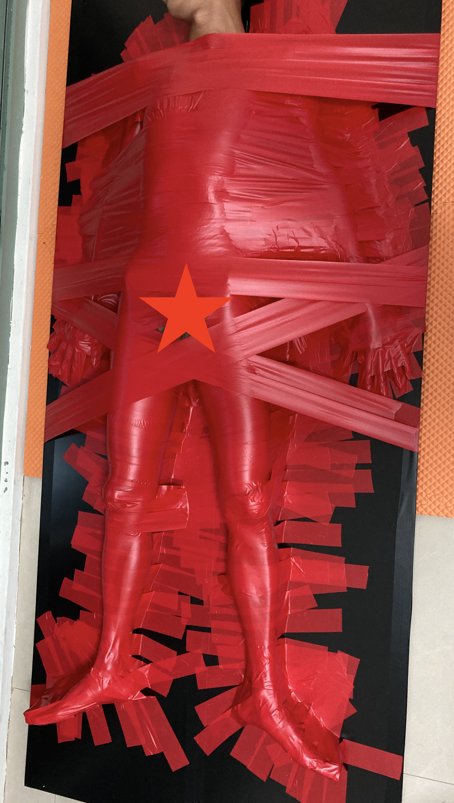

膠帶黏牆上 / 壁雕
===


對拘束控來說，看了這張圖就忘不掉了，所以就嘗試做了實驗。

## 資源
網路上搜尋一下，意外的發現很多人喜歡把人貼在牆上ＸＤ

普遍來說是使用強力膠帶，不過直接往牆壁貼這個心臟有點大顆，總覺得房東接下來就要抓狂了ＸＤ

* [Youtube: TAPED TO THE WALL PRANK! // Dolan Twins](https://www.youtube.com/watch?v=U0dmqqtKnHQ)

## 材料

* 電火布 / 電工膠布 約6cm寬，約6捲
* [木板裁切訂製](https://www.ruten.com.tw/item/show?21623834062265) 9mm有色貼皮夾板(時尚黑) 整塊無裁切 90x210cm，他為了運送所以裁切成了兩片，需要另外準備幾根木條把它重新合併起來。我是採用拿大塊巧拼直接用強力膠黏合，並用金屬片強化兩片木板連接處
* 準備了吊車使用的金屬環固定於頂部，本來想說用吊車立起來，不過最後沒派上用場


## 過程

大致上如同[膠帶木乃伊](tape_mummy.md)

本次直接裸體被貼，沒有如木乃伊一樣使用保鮮膜保護，請先測試皮膚是否會過敏

下次也應該先在身後放置一些軟墊，減少長時間的痛感問題

先對身體做大致上的膠帶固定，關節、手腳掌最後才貼，GG與頭部避開不貼

預定貼兩層，底部會貼的比較近，第二層則是從木板邊到另一邊，膠帶要長到可以稍微貼到木板背面，這一層拉好看一點。





#### 受試者感想
```
木乃伊的變化方法，而且比較容易受傷！畢竟貼好之後立起來會因為地心引力往下掉，造成些許拉傷，也有可能會壓到神經血管，這點要注意！然而這也是個考驗耐力的實驗，被貼好就花了快兩個小時，像我竹竿身材還有壓太久的痛點問題，膠帶兩側要平貼身體之後再貼在板子，空隙越多越容易不舒服，剩下的就跟玩木乃伊需要注意的點差不多。
```
