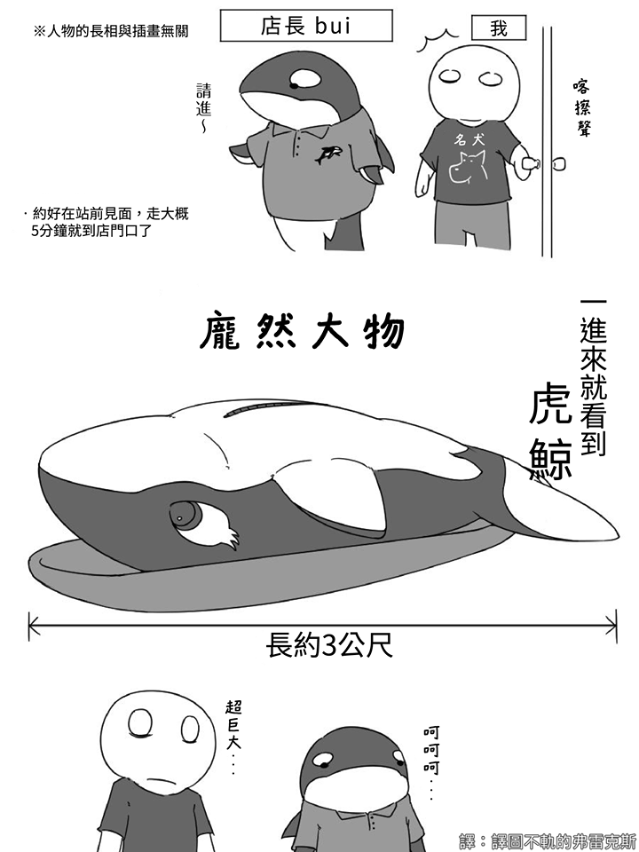
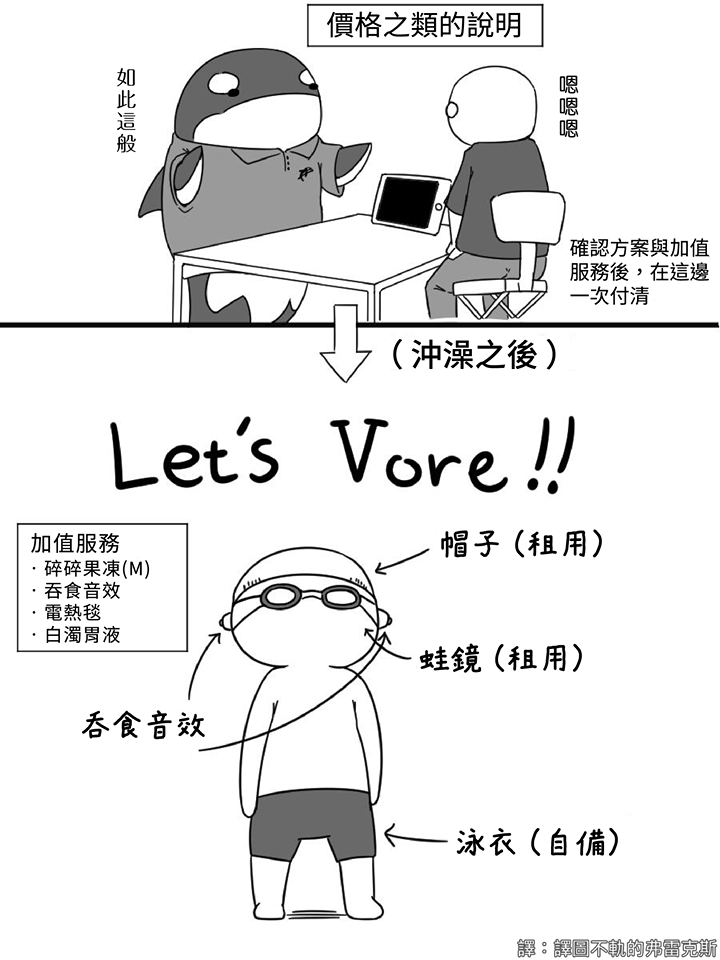
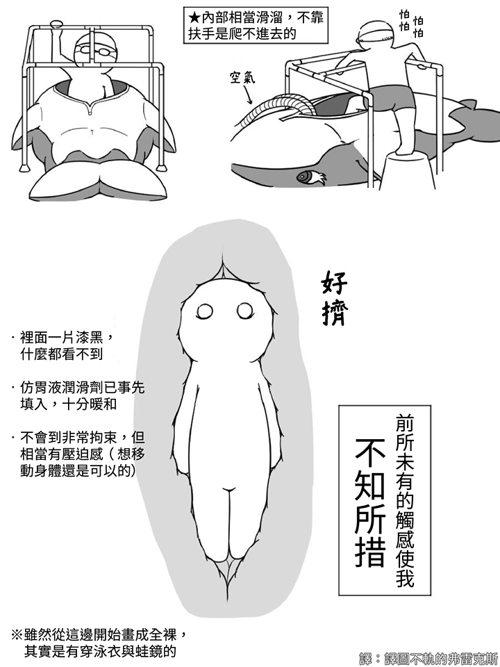
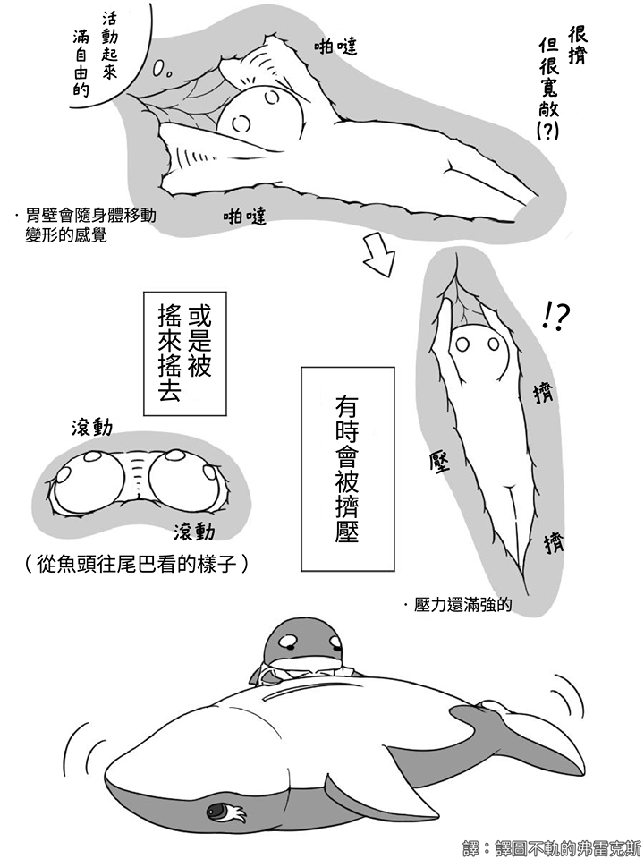
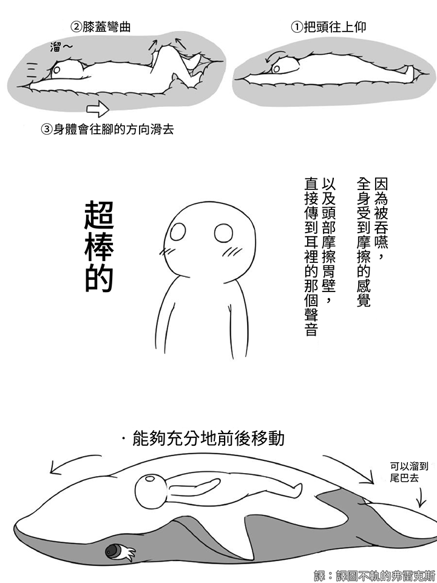
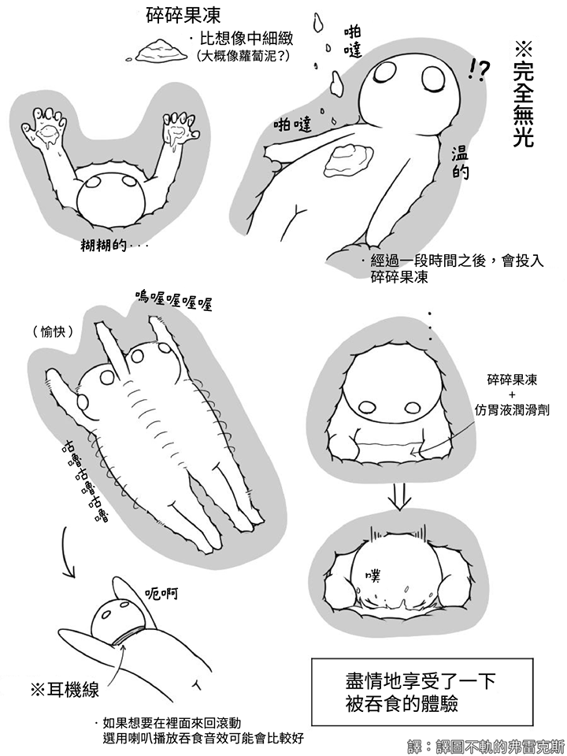
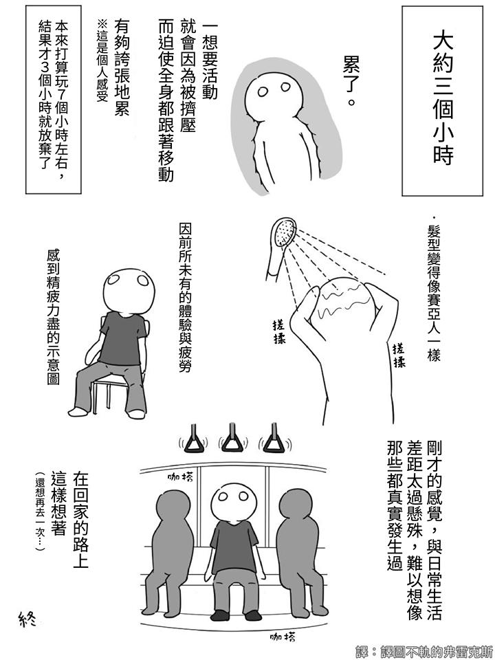

丸吞 / vore
===
被巨大的蛇、鯨魚之類的生物捕食或吞下，或者是被大型的史萊姆、觸手捕捉困在體內，除了無用的掙扎，只能接受無止境地玩弄與產卵...

這是一個滿特殊的嗜好，裡面也有很多分支與特殊屬性。共通點是「被吞入腹中」，某些程度可以視為一種重度拘束的延伸吧？

講到Vore, 就不能不提到日本的[Vore Cafe](https://vorecafe.com/)。他是第一個提供場地給大眾體驗被吞食的感受的地方，有一隻充氣的大鯨魚提供服務。可惜因為太過熱門，預約都要一個月前進行，如果有機會去東京的話一定要體驗看看。

如果有興趣自己做一隻鯨魚，請參考渡貍的[這篇](inflatable_whale.md)，也有美國訂做的[商店](https://www.etsy.com/listing/797731277/3-meter-inflatable-pvc-whale-suit-made?ga_order=most_relevant&ga_search_type=all&ga_view_type=gallery&ga_search_query=inflatable+whale+suit&ref=sr_gallery-1-2&organic_search_click=1&cns=1)

## tags

## 資源

- [Twitter: ウーガリ（Yuren SIzuku）](https://twitter.com/SizukuYuren/status/1286201961734275072)
- [pixiv: かなとふ](https://www.pixiv.net/users/19116803)
- [pixiv: もちネコ](https://www.pixiv.net/users/4241)
- [pixiv: higawariJelly](https://www.pixiv.net/users/691778)

## 具爭議的屬性

畢竟「吞食」在真實世界中並不是什麼美妙的事情，所以每個人對於Vore這件事往往都會有一些「選擇性偏好」。以下從接受度高到低列出一些比較有爭議的屬性，當你在搜尋資源的時候可以依照自己的愛好做出過濾。

- 觸手、產卵：這是很多丸吞愛用的場景，被觸手怪/植物抓住之後作為苗床。
- 獵捕、受傷：有時為了強調「獵物被追殺」的場景與無助，會包含追逐、捕捉、抓咬等場景，往往會有流血表現。
- 便便：吞下去之後，出口往往就是肛門，所以究竟是無傷脫出、夾在便便中掙扎、變成不同的東西，還是就直接成為一坨屎，也有看過許多不同的表現。
- 缺氧：想當然爾，吞入腹中是不會有氧氣供應的，不過這在大多數Vore的作品中都是被忽略的。
- 擠壓：蟒蛇類的吞食一般來說會包含「勒斃獵物」的動作，這個動作往往是足以造成全身性複雜性骨折的。
- 消化：進入胃中馬上就會面對胃酸，會有這個描寫的往往會分為「只溶解衣物」「只留下骨頭」「骨頭都不剩」這幾種分野
- 死亡：往往會同時帶有 消化、缺氧、獵捕 等屬性